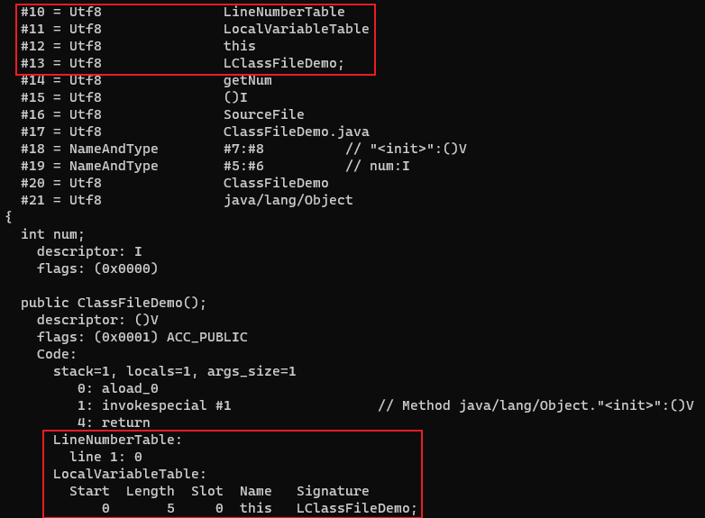

# LineNumberTable 属性

LineNumberTable 属性用于描述 Java 源码行号与字节码行号之间的对应关系。它不是运行时必需的属性, 但默认会生成到 Class 文件之中。如果选择不生成 LineNumberTable 属性, 当抛出异常时, 堆栈中将不会显示出错的行号, 并且在调试程序的时候, 也无法按照源码行来设置断点。

| 类型             | 名称                     | 数量                     |
| ---------------- | ------------------------ | ------------------------ |
| u2               | attribute_name_index     | 1                        |
| u4               | attribute_length         | 1                        |
| u2               | line_number_table_length | 1                        |
| line_number_info | line_number_table        | line_number_table_length |

line_number_table 是一个数量为 line_number_table_length、类型为 line_number_info 的集合, line_number_info 包含 start_pc 和 line_number 两个 u2 类型的数据项, 前者是字节码行号, 后者是 Java 源码行号。

---

Code 属性表中的第一个属性: attribute_name_index 为`0x000A`, 指向常量池中索引为 10 的值`LineNumberTable`。attribute_length 为`0x00000006`, line_number_table_length 为`0x0001`。line_number_info 中的 start_pc 为`0x0000`, line_number 为`0x0001`。

使用 javap -verbose ClassFileDemo.class 命令解析 class 文件:

