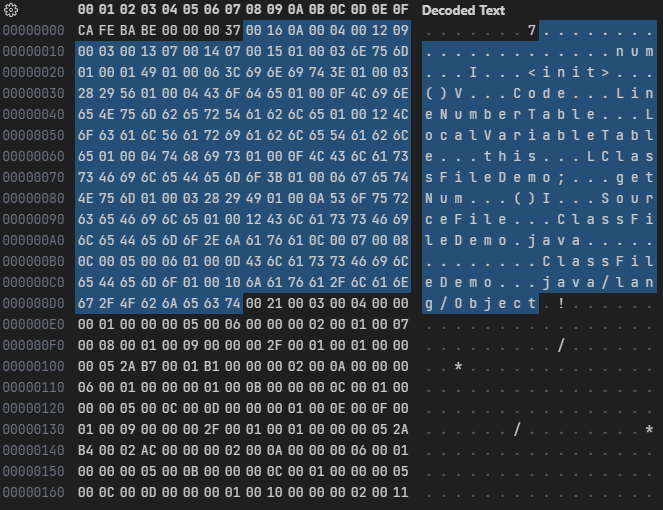
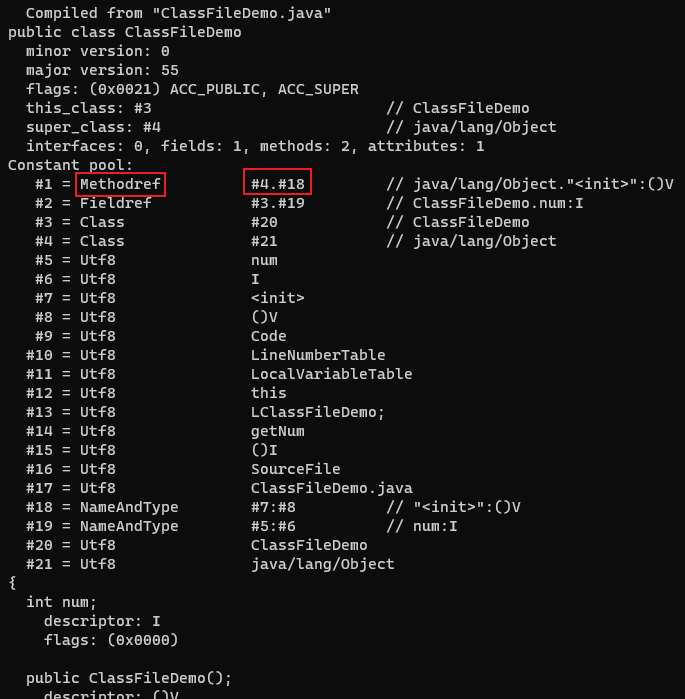

# 常量池

紧接着版本号之后的是常量池的容量(constant_pool_count)，表示常量池的大小。

常量池的索引是从 1 开始的。如果后面某些指向常量池的索引值的数据在特定情况下需要表达不引用任何一个常量池项目，可以把索引值设置为 0 来表示。

常量池中主要存放两大类常量：字面量(Literal)和符号引用(Symbolic References)。

- 字面量比较接近于 Java 的常量概念，如文本字符串、被声明为 final 的常量值等
- 符号引用主要包括：被模块导出或者开放的包、类和接口的全限定名、字段的名称和描述符、方法的名称和描述符、方法句柄和方法类型、动态调用点和动态常量

Java 代码在进行编译的时候，并不像 C 和 C++那样有链接这一步骤，而是在 JVM 进行类加载的时候进行动态连接。在 class 文件中不会保存各个方法、字段最终在内存中的地址。当 JVM 加载类时，会从常量池中获得对应的符号引用，再把符号引用转换成具体的内存地址。

常量池中每一项常量都是一个表，常量表中分别有 17 种不同类型的常量。表结构起始的第一位是个 u1 类型的标志位，代表着当前常量属于哪种常量类型。这 17 种常量类型各自有着完全独立的数据结构。

## 常量池的项目类型

| 类型                             | 标志(十进制) | 说明                       |
| -------------------------------- | ------------ | -------------------------- |
| CONSTANT_Utf8_info               | 1            | UTF-8 编码的字符串         |
| CONSTANT_Integer_info            | 3            | 整型字面量                 |
| CONSTANT_Float_info              | 4            | 浮点型字面量               |
| CONSTANT_Long_info               | 5            | 长整型字面量               |
| CONSTANT_Double_info             | 6            | 双精度浮点型字面量         |
| CONSTANT_Class_info              | 7            | 类或接口的符号引用         |
| CONSTANT_String_info             | 8            | 字符串类型字面量           |
| CONSTANT_Fieldref_info           | 9            | 字段的符号引用             |
| CONSTANT_Methodref_info          | 10           | 类中方法的符号引用         |
| CONSTANT_InterfaceMethodref_info | 11           | 接口中方法的符号引用       |
| CONSTANT_NameAndType_info        | 12           | 字段或方法的部分符号引用   |
| CONSTANT_MethodHandle_info       | 15           | 方法句柄                   |
| CONSTANT_MethodType_info         | 16           | 方法类型                   |
| CONSTANT_Dynamic_info            | 17           | 动态计算常量               |
| CONSTANT_InvokeDynamic_info      | 18           | 动态方法调用点             |
| CONSTANT_Module_info             | 19           | 模块                       |
| CONSTANT_Package_info            | 20           | 一个模块中开放或者导出的包 |

## 常量池中的 17 种数据类型的结构

| 常量                             | 项目                        | 类型 | 描述                                                                                                              |
| -------------------------------- | --------------------------- | ---- | ----------------------------------------------------------------------------------------------------------------- |
| CONSTANT_Utf8_info               | tag                         | u1   | 值为 1                                                                                                            |
| -                                | length                      | u2   | UTF-8 编码的字符串占用的字节数                                                                                    |
| -                                | bytes                       | u1   | 长度为 length 的字符串                                                                                            |
| CONSTANT_Integer_info            | tag                         | u1   | 值为 3                                                                                                            |
| -                                | bytes                       | u4   | 按照高位在前存储的 int 值                                                                                         |
| CONSTANT_Float_info              | tag                         | u1   | 值为 4                                                                                                            |
| -                                | bytes                       | u4   | 按照高位在前存储的 float 值                                                                                       |
| CONSTANT_Long_info               | tag                         | u1   | 值为 5                                                                                                            |
| -                                | bytes                       | u8   | 按照高位在前存储的 long 值                                                                                        |
| CONSTANT_Double_info             | tag                         | u1   | 值为 6                                                                                                            |
| -                                | bytes                       | u8   | 按照高位在前存储的 double 值                                                                                      |
| CONSTANT_Class_info              | tag                         | u1   | 值为 7                                                                                                            |
| -                                | index                       | u2   | 指向全限定名常量项的索引                                                                                          |
| CONSTANT_String_info             | tag                         | u1   | 值为 8                                                                                                            |
| -                                | index                       | u2   | 指向字符串字面量的索引                                                                                            |
| CONSTANT_Fieldref_info           | tag                         | u1   | 值为 9                                                                                                            |
| -                                | index                       | u2   | 指向声明字段的类或者接口描述符 CONSTANT Class info 的索引项                                                       |
| -                                | index                       | u2   | 指向字段描述符 CONSTANT_NameAndType_info 的索引项                                                                 |
| CONSTANT_Methodref_info          | tag                         | u1   | 值为 10                                                                                                           |
| -                                | index                       | u2   | 指向声明方法的类描述符 CONSTANT_Class info 的索引项                                                               |
| -                                | index                       | u2   | 指向名称及类型描述符 CONSTANT_NameAndType_info 的索引项                                                           |
| CONSTANT_InterfaceMethodref_info | tag                         | u1   | 值为 11                                                                                                           |
| -                                | index                       | u2   | 指向声明方法的接口描述符 CONSTANT_Class info 的索引项                                                             |
| -                                | index                       | u2   | 指向名称及类型描述符 CONSTANT_NameAndType_info 的索引项                                                           |
| CONSTANT_NameAndType_info        | tag                         | u1   | 值为 12                                                                                                           |
| -                                | index                       | u2   | 指向该字段或方法名称常量项的索引                                                                                  |
| -                                | index                       | u2   | 指向该字段或方法描述符常量项的索引                                                                                |
| CONSTANT_MethodHandle_info       | tag                         | u1   | 值为 15                                                                                                           |
| -                                | reference_kind              | u1   | 值必须在 1 至 9 之间(包括 1 和 9)，它决定了方法句柄的类型。方法句柄类型的值表示方法句柄的字节码行为               |
| -                                | reference_index             | u2   | 值必须是对常量池的有效索引                                                                                        |
| CONSTANT_MethodType_info         | tag                         | u1   | 值为 16                                                                                                           |
| -                                | descriptor_index            | u2   | 值必须是对常量池的有效索引，常量池在该索引处的项必须是 CONSTANT_Utf8_info 结构，表示方法的描述符                  |
| CONSTANT_Dynamic_info            | tag                         | u1   | 值为 17                                                                                                           |
| -                                | bootstrap_method_attr_index | u2   | 值必须是对当前 Class 文件中引导方法表的 bootstrap_methods[]数组的有效索引                                         |
| -                                | name_and_type_index         | u2   | 值必须是对当前常量池的有效索引，常量池在该索引处的项必须是 CONSTANT_NameAndType_info 结构，表示方法名和方法描述符 |
| CONSTANT_InvokeDynamic_info      | tag                         | u1   | 值为 18                                                                                                           |
| -                                | bootstrap_method_attr_index | u2   | 值必须是对当前 Class 文件中引导方法表的 bootstrap_methods[]数组的有效索引                                         |
| -                                | name_and_type_index         | u2   | 值必须是对当前常量池的有效索引，常量池在该索引处的项必须是 CONSTANT_NameAndType_info 结构，表示方法名和方法描述符 |
| CONSTANT_Module_info             | tag                         | u1   | 值为 19                                                                                                           |
| -                                | name_index                  | u2   | 值必须是对当前常量池的有效索引，常量池在该索引处的项必须是 CONSTANT_Utf8_info 结构，表示模块名字                  |
| CONSTANT_Package_info            | tag                         | u1   | 值为 20                                                                                                           |
| -                                | name_index                  | u2   | 值必须是对当前常量池的有效索引，常量池在该索引处的项必须是 CONSTANT_Utf8_info 结构，表示包名称                    |

---

```java
public class ClassFileDemo {
    int num;

    public int getNum() {
        return this.num;
    }
}
```

字节码文件内容:



常量池容量为`0x0016`，即十进制的 22，代表常量池中有 21 项常量，索引值范围为 1 ～ 21。

以常量池的第一项常量为例，它的标志位是`0x0A`，即十进制的 10，对应的常量是 CONSTANT_Methodref_info 类型，此类型的常量代表一个类中方法的符号引用。CONSTANT_Methodref_info 类型的结构是：tag+index+index。所以紧接着标志位的是指向声明方法的类描述符 CONSTANT_Class info 的索引项`0x0004`。再后面是指向名称及类型描述符 CONSTANT_NameAndType_info 的索引项`0x0012`，即十进制的 18。

使用 javap -verbose ClassFileDemo.class 命令解析 class 文件，可以对应上第一项常量的内容：


