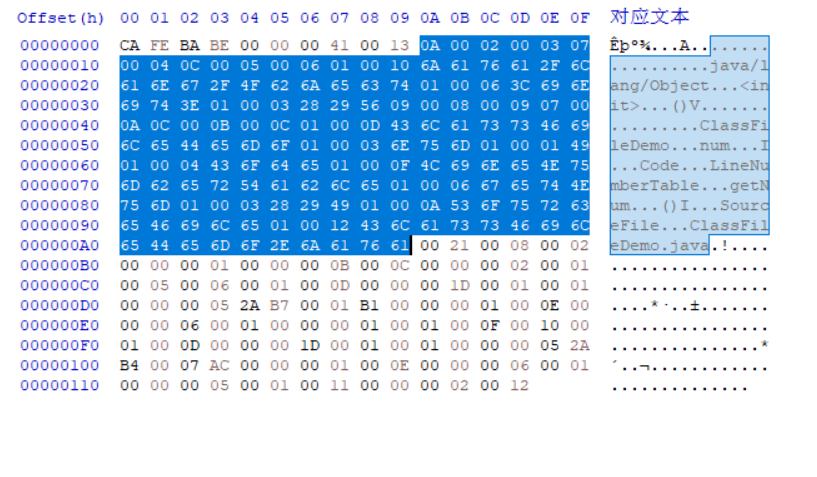
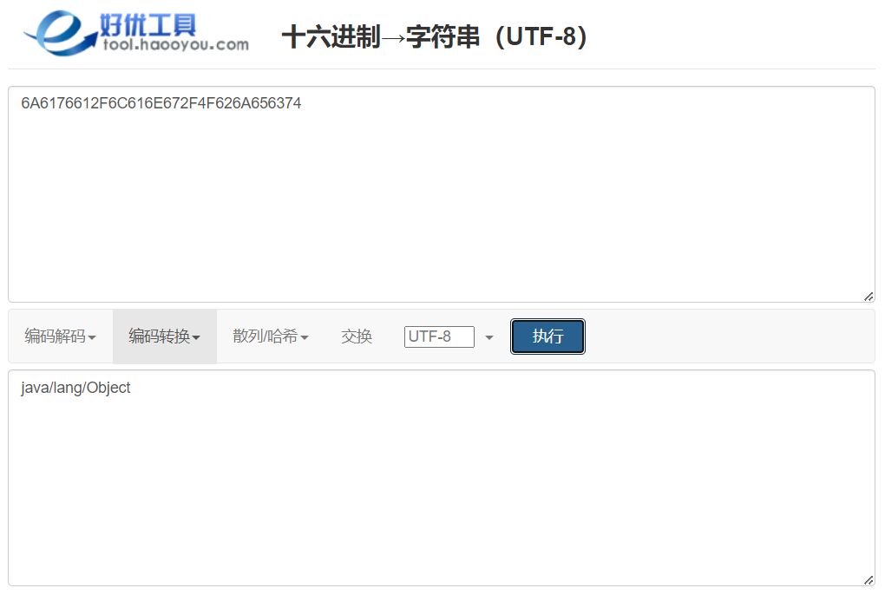
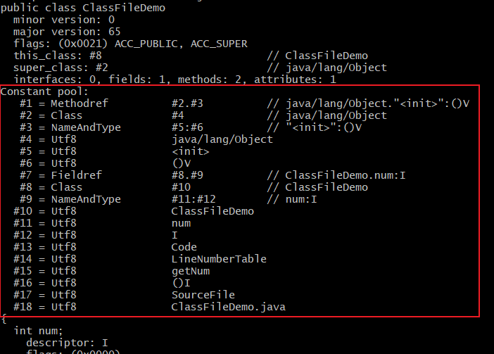

# 常量池中的常量

常量池中主要存放两大类常量: 字面量(Literal)和符号引用(Symbolic References)。

- 字面量比较接近于 Java 的常量概念, 如文本字符串、被声明为 final 的常量值等
- 符号引用主要包括: 被模块导出或者开放的包、类和接口的全限定名、字段的名称和描述符、方法的名称和描述符、方法句柄和方法类型、动态调用点和动态常量

Java 代码在进行编译的时候, 并不像 C 和 C++那样有链接这一步骤, 而是在 JVM 进行类加载的时候进行动态连接。在 class 文件中不会保存各个方法、字段最终在内存中的地址。当 JVM 加载类时, 会从常量池中获得对应的符号引用, 再把符号引用转换成具体的内存地址。

常量池中每一项常量都是一个表, 截止到 JDK21, 常量池中有 17 种不同类型的常量。每一个常量表结构的第一位是个 u1 类型的标志位, 代表着当前常量属于哪种常量类型。这 17 种常量类型各自有着完全独立的数据结构。

| 类型                        | 标志(十进制) | 说明                       |
| --------------------------- | ------------ | -------------------------- |
| CONSTANT_Utf8               | 1            | UTF-8 编码的字符串         |
| CONSTANT_Integer            | 3            | 整型字面量                 |
| CONSTANT_Float              | 4            | 浮点型字面量               |
| CONSTANT_Long               | 5            | 长整型字面量               |
| CONSTANT_Double             | 6            | 双精度浮点型字面量         |
| CONSTANT_Class              | 7            | 类或接口的符号引用         |
| CONSTANT_String             | 8            | 字符串类型字面量           |
| CONSTANT_Fieldref           | 9            | 字段的符号引用             |
| CONSTANT_Methodref          | 10           | 类中方法的符号引用         |
| CONSTANT_InterfaceMethodref | 11           | 接口中方法的符号引用       |
| CONSTANT_NameAndType        | 12           | 字段或方法的部分符号引用   |
| CONSTANT_MethodHandle       | 15           | 方法句柄                   |
| CONSTANT_MethodType         | 16           | 方法类型                   |
| CONSTANT_Dynamic            | 17           | 动态计算常量               |
| CONSTANT_InvokeDynamic      | 18           | 动态方法调用点             |
| CONSTANT_Module             | 19           | 模块                       |
| CONSTANT_Package            | 20           | 一个模块中开放或者导出的包 |

我们解析一下 ClassFileDemo.class 文件中的常量池。

## #1

最开始的是常量池索引为 1 的常量, 它的标志位是 0x0A(十进制 10), 是一个 CONSTANT_Methodref 类型的常量, CONSTANT_Methodref 的结构如下:

| 常量                    | 项目  | 类型 | 描述                                               |
| ----------------------- | ----- | ---- | -------------------------------------------------- |
| CONSTANT_Methodref_info | tag   | u1   | 值为 10                                            |
| -                       | index | u2   | 指向声明方法的类描述符 CONSTANT_Class 的索引项     |
| -                       | index | u2   | 指向名称及类型描述符 CONSTANT_NameAndType 的索引项 |

两个 index 的值分别是 0x0002 和 0x0003。

## #2

接下来是索引为 2 的常量, 它的标志位是 0x07(十进制 7), 是一个 CONSTANT_Class 类型的常量, CONSTANT_Class 的结构如下:

| 常量                | 项目  | 类型 | 描述                     |
| ------------------- | ----- | ---- | ------------------------ |
| CONSTANT_Class_info | tag   | u1   | 值为 7                   |
| -                   | index | u2   | 指向全限定名常量项的索引 |

它只有一个 index, 值是 0x0004。

## #3

接下来是索引为 3 的常量, 它的标志位是 0x0C(十进制 12), 是一个 CONSTANT_NameAndType 类型的常量, CONSTANT_NameAndType 的结构如下:

| 常量                      | 项目  | 类型 | 描述                               |
| ------------------------- | ----- | ---- | ---------------------------------- |
| CONSTANT_NameAndType_info | tag   | u1   | 值为 12                            |
| -                         | index | u2   | 指向该字段或方法名称常量项的索引   |
| -                         | index | u2   | 指向该字段或方法描述符常量项的索引 |

两个 index 的值分别是 0x0005 和 0x0006。

## #4

接下来是索引为 4 的常量, 它的标志位是 0x01(十进制 1), 是一个 CONSTANT_Utf8 类型的常量, CONSTANT_Utf8 的结构如下:

| 常量               | 项目   | 类型 | 描述                           |
| ------------------ | ------ | ---- | ------------------------------ |
| CONSTANT_Utf8_info | tag    | u1   | 值为 1                         |
| -                  | length | u2   | UTF-8 编码的字符串占用的字节数 |
| -                  | bytes  | u1   | 长度为 length 的字符串         |

length 为 0x0010 (十进制 16), 接下来的 16 个字节就是 utf8 编码的字符串: 0x6A6176612F6C616E672F4F626A656374, 随便找 1 个 16 进制转 utf8 的工具解码一下, 得到字符串"java/lang/Object":

## #5

接下来是索引为 5 的常量, 它的标志位是 0x01(十进制 1), 也是一个 CONSTANT_Utf8 类型的常量, length 为 0x006 (十进制 6), 接下来的 6 个字节就是 utf8 编码的字符串: 0x3C696E69743E, 解码后得到字符串"`<init>`"。

## #6

接下来是索引为 6 的常量, 同样是一个 CONSTANT_Utf8 类型的常量, length 为 0x003 (十进制 3), 接下来的 3 个字节就是 utf8 编码的字符串: 0x282956, 解码后得到字符串"()V"。

整理一下前 6 个常量:

| 索引 | 类型                      | 值               | 描述                     |
| ---- | ------------------------- | ---------------- | ------------------------ |
| #1   | CONSTANT_Methodref        | #2, #3           | 类中方法的符号引用       |
| #2   | CONSTANT_Class            | #4               | 类或接口的符号引用       |
| #3   | CONSTANT_NameAndType_info | #5, #6           | 字段或方法的部分符号引用 |
| #4   | CONSTANT_Utf8_info        | java/lang/Object | UTF-8 编码的字符串       |
| #5   | CONSTANT_Utf8_info        | `<init>`         | UTF-8 编码的字符串       |
| #6   | CONSTANT_Utf8_info        | ()V              | UTF-8 编码的字符串       |

与使用 javap 解析的结果一致:

