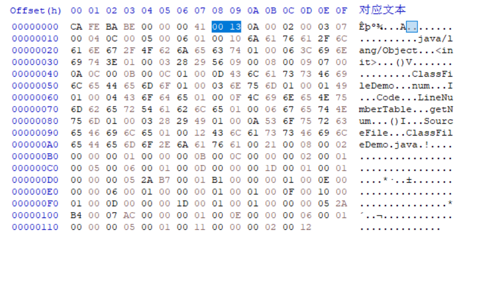

# 常量池

常量池包含了 class 文件中用到的各种字符串常量、类和接口名、字段和方法名等符号引用，以及字面量常量值等信息。

主版本号后面的 2 个字节是 constant_pool_count, 它表示常量池中常量的个数。

ClassFileDemo.class 文件中的 constant_pool_count 是  0x0013, 转换成十进制是 19, 代表常量池中有 18  项常量, 索引范围是  1 ～ 18 (常量池的索引是从 1 开始的)。



ClassFileDemo.class 文件中的常量池内容如下:


使用 javap 命令可以更方便的查看 class 文件的内容:

```sh
javap -verbose ClassFileDemo.class
```

其中常量池部分如下:


