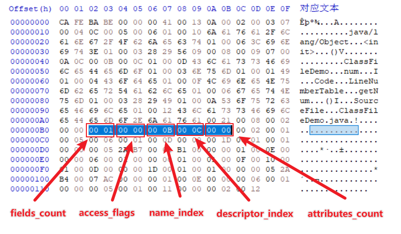

# 字段

Java 中的字段(Field)包括类变量和实例变量, 通过 class 文件中的字段个数(fields_count)和字段集合(fields)共同表示。字段个数表示类中定义了多少个字段, 这些字段存放在字段集合中, 字段集合由字段表(field_info)组成。字段集合中不会列出从父类或者父接口中继承而来的字段, 但有可能会有编译器自动添加的字段。

字段表(field_info)用于描述接口或者类中声明的字段, 定义如下:

| 类型           | 名称             | 数量             |
| -------------- | ---------------- | ---------------- |
| u2             | access_flags     | 1                |
| u2             | name_index       | 1                |
| u2             | descriptor_index | 1                |
| u2             | attributes_count | 1                |
| attribute_info | attributes       | attributes_count |

name_index 和 descriptor_index 都是对常量池中常量的引用, 分别代表着字段名以及字段的描述符。attributes_count 表示 attributes 中元素的个数, attributes 保存了字段的附加属性。access_flags 是字段的访问标志, 用于表示字段是否为 public, 是否为 static 等等。

access_flags 的结构如下:

| 标志          | 值     | 说明                     |
| ------------- | ------ | ------------------------ |
| ACC_PUBLIC    | 0x0001 | 字段是否 public          |
| ACC_PRIVATE   | 0x0002 | 字段是否 private         |
| ACC_PROTECTED | 0x0004 | 字段是否 protected       |
| ACC_STATIC    | 0x0008 | 字段是否 static          |
| ACC_FINAL     | 0x0010 | 字段是否 final           |
| ACC_VOLATILE  | 0x0040 | 字段是否 volatile        |
| ACC_TRANSIENT | 0x0080 | 字段是否 transient       |
| ACC_SYNTHETIC | 0x1000 | 字段是否由编译器自动生成 |
| ACC_ENUM      | 0x4000 | 字段是否 enum            |

access_flags 需要满足以下几个条件:

- ACC_PUBLIC、ACC_PRIVATE、ACC_PROTECTED 不能同时选择
- ACC_FINAL、ACC_VOLATILE 不能同时选择
- 接口之中的字段必须有 ACC_PUBLIC、ACC_STATIC、ACC_FINAL 标志

接下来看一下字段描述符, 它的定义如下:

| 标识字符 | 说明                              |
| -------- | --------------------------------- |
| B        | 基本类型 byte                     |
| C        | 基本类型 char                     |
| D        | 基本类型 double                   |
| F        | 基本类型 float                    |
| I        | 基本类型 int                      |
| J        | 基本类型 long                     |
| S        | 基本类型 short                    |
| Z        | 基本类型 boolean                  |
| V        | 特殊类型 void                     |
| L        | 对象类型, 比如 Ljava/lang/Object; |

对于数组类型, 每一维度将使用一个前置的`[`字符来描述, 比如二维数组`String[][]`的字段描述符是: `[[Ljava/lang/String;`, 一个整型数组`int[]`的字段描述符是: `[I`。

ClassFileDemo 类中只有一个字段: `int num`, class 文件中的数据如下:

access_flags 为 0x0000, 表示字段没有修饰符。name_index 为 0x000B, 指向常量池中索引为 11 的值"num"。descriptor_index 为 0x000C, 指向常量池中索引为 12 的值"I"。attributes_count 为 0, 表示这个字段没有额外的属性。
