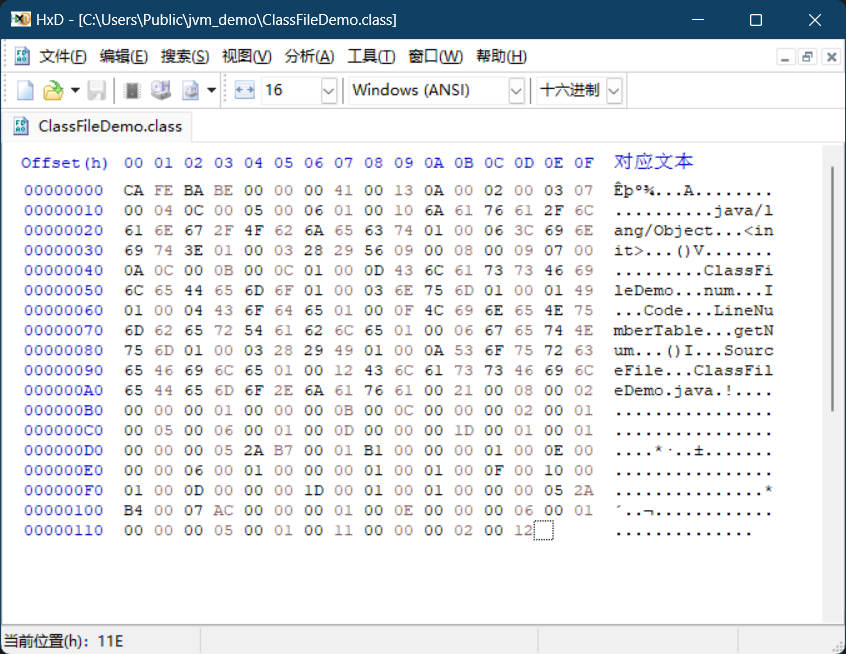

# 编译一个 java 文件

创建一个名为 ClassFileDemo.java 的文件, 输入下面内容:

```java
public class ClassFileDemo {
    int num;

    public int getNum() {
        return this.num;
    }
}
```

打开命令行, 使用 javac 编译:

```sh
javac ClassFileDemo.java
```

在同一目录下会生成一个 ClassFileDemo.class 文件, 由于 class 文件不是文本文件, 无法用文本编辑器直接打开, 需要使用 16 进制编辑器打开。


