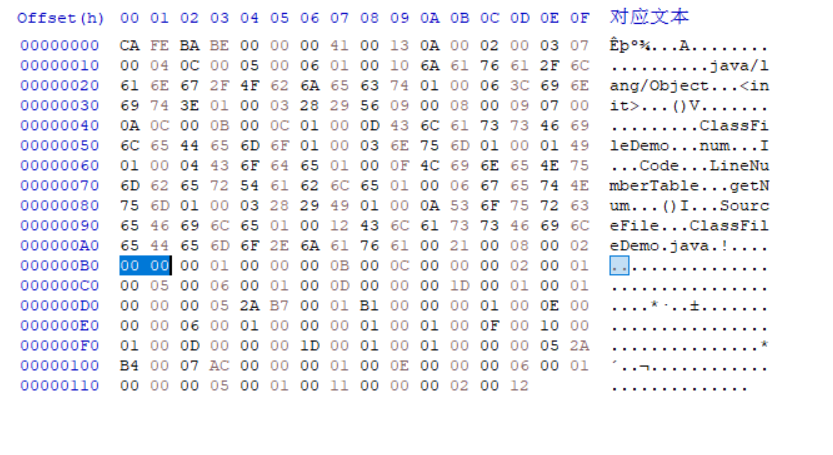

# 接口

接口个数(interfaces_count)和接口索引集合(interfaces)用来描述这个类实现的接口。接口个数表示这个类实现了几个接口, 这些被实现的接口将按 implements 关键字后的接口顺序从左到右排列在接口索引集合中。

接口个数是一个 u2 类型的数据, 表示接口索引集合的容量。如果该类没有实现任何接口, 则接口个数值为 0, 后面的接口索引集合不再占用任何字节。如果实现了接口, 则接口索引集合中会有一组接口索引, 每个接口索引占 2 个字节, 指向常量池中的 CONSTANT_Class 常量。

ClassFileDemo 没有实现任何接口, 所以它的接口个数为 0, 接口索引集合也不再占用任何字节。

