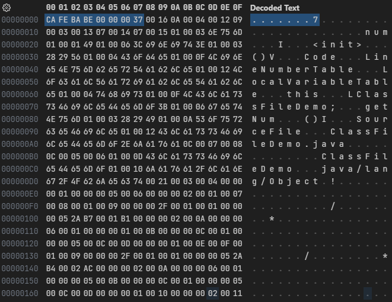

# 魔数和版本号

```java
public class ClassFileDemo {
    int num;

    public int getNum() {
        return this.num;
    }
}
```

上面的代码编译成字节码后, 字节码文件的内容:



每个 class 文件的头 4 个字节被称为魔数(Magic Number), 它的唯一作用是表示这个文件是一个 class 文件, 固定为`0xCAFEBABE`。

紧接着魔数的 4 个字节是 class 文件的版本号: 第 5 和第 6 个字节是副版本号(Minor Version), 第 7 和第 8 个字节是主版本号(Major Version)。

Java 的版本号是从 45 开始的, JDK 1.1 之后的每个 JDK 大版本发布主版本号向上加 1, 高版本的 JDK 能向下兼容以前版本的 class 文件, 但不能运行以后版本的 class 文件。

示例中的版本号`0x0000`和`0x0037`转换成十进制是 55.0, 即 JDK 11。
