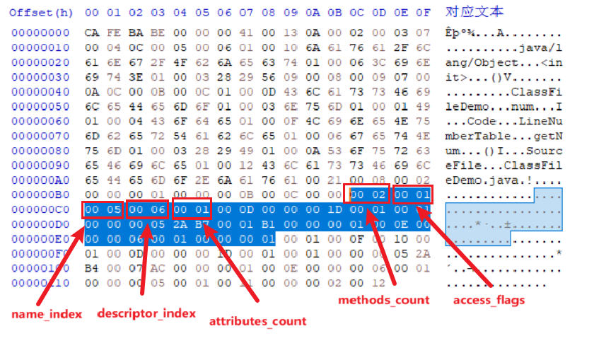

# 方法

Java 中的方法使用方法个数(methods_count)和方法集合(methods)描述。方法集合由方法表(method_info)组成。如果父类方法在子类中没有被重写, 方法集合中就不会出现来自父类的方法。但有可能会出现由编译器自动添加的方法, 比如类构造器`<clinit>()`方法和实例构造器`<init>()`方法。

方法表的结构与字段表一样:

| 类型           | 名称             | 数量             |
| -------------- | ---------------- | ---------------- |
| u2             | access_flags     | 1                |
| u2             | name_index       | 1                |
| u2             | descriptor_index | 1                |
| u2             | attributes_count | 1                |
| attribute_info | attributes       | attributes_count |

name_index 和 descriptor_index 在方法表中分别代表着方法名以及方法的描述符, attributes 保存了方法的附加属性。方法描述符与字段的描述符定义也完全一致。

有区别的是方法的访问标志(access_flags), 定义如下:

| 标志             | 值     | 说明                           |
| ---------------- | ------ | ------------------------------ |
| ACC_PUBLIC       | 0x0001 | 方法是否 public                |
| ACC_PRIVATE      | 0x0002 | 方法是否 private               |
| ACC_PROTECTED    | 0x0004 | 方法是否 protected             |
| ACC_STATIC       | 0x0008 | 方法是否 static                |
| ACC_FINAL        | 0x0010 | 方法是否 final                 |
| ACC_SYNCHRONIZED | 0x0020 | 方法是否为 synchronized        |
| ACC_BRIDGE       | 0x0040 | 方法是否为编译器产生的桥接方法 |
| ACC_VARARGS      | 0x0080 | 方法是否接受不定参数           |
| ACC_NATIVE       | 0x0100 | 方法是否为 native              |
| ACC_ABSTRACT     | 0x0400 | 方法是否为 abstract            |
| ACC_STRICT       | 0x0800 | 方法是否为 strictfp            |
| ACC_SYNTHETIC    | 0x1000 | 方法是否由编译器自动产生       |

用描述符来描述方法时, 按照先参数列表、后返回值的顺序描述, 参数列表按照参数的顺序放在一组小括号之内。

以下是一些方法描述符的示例:

```java
// ()V
void inc();
// ()Ljava/lang/String;
String toString();
// ([CII[CIII)I
int indexOf(char[]source,int sourceOffset,int sourceCount,char[]target,int targetOffset,int targetCount,int fromIndex);
```

方法的定义可以通过访问标志、名称索引、描述符索引来表达清楚, 而方法里面的代码经过编译后, 会存放在方法的附加属性(attributes)中一个名为 Code 的属性(attribute_info)里面。

ClassFileDemo 类中有两个方法, 一个是编译器自动生成的构造器 `<init>()` 方法, 另一个是源码中的 getNum() 方法。

图中标出了方法个数和方法集合中的第一个方法:



access_flags 为 0x0001, 表示这个方法的修饰符是 ACC_PUBLIC。name_index 为 0x0005, 指向常量池中索引为 5 的值"`<init>`"。descriptor_index 为 0x0006, 指向常量池中索引为 6 的值"()V"。attributes_count 为 1, 表示这个方法有 1 个附加属性。
