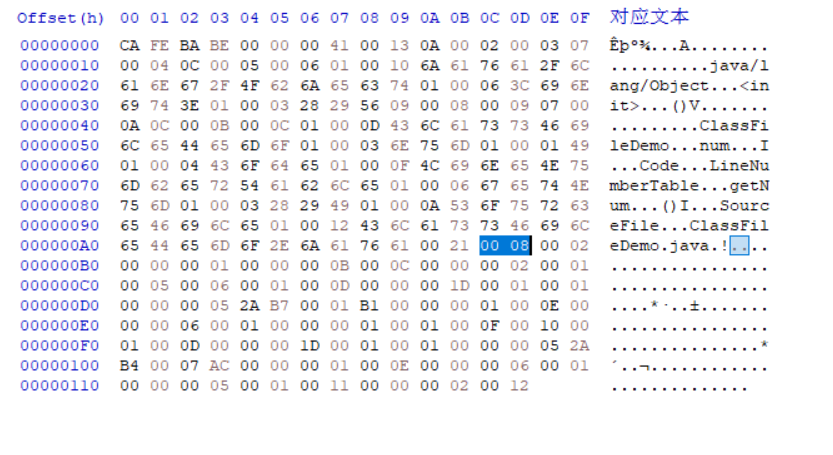

# 类索引

类索引(this_class)是一个 u2 类型的数据, 用于确定这个类的全名。它的索引值指向常量池中 CONSTANT_Class 类型的常量。而 CONSTANT_Class 类型的常量中有一个索引值又指向了常量池中 CONSTANT_Utf8 类型的常量。CONSTANT_Utf8 常量中使用 UTF-8 编码的字符串存储了这个类的全名。

ClassFileDemo.class 文件中类索引的值是 0x0008, 指向了常量池中索引为 8 的常量。查看常量池, 可以看到索引 8 的常量正是 CONSTANT_Class 类型的常量, 它又指向了索引 10 的字符串常量"ClassFileDemo"。

