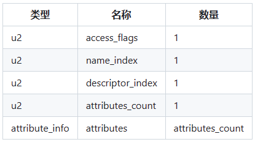
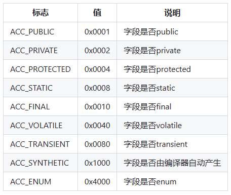
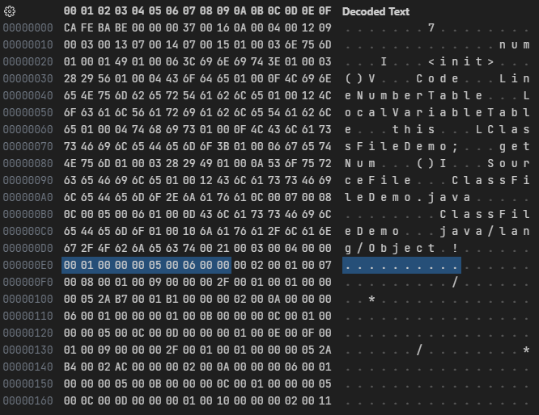
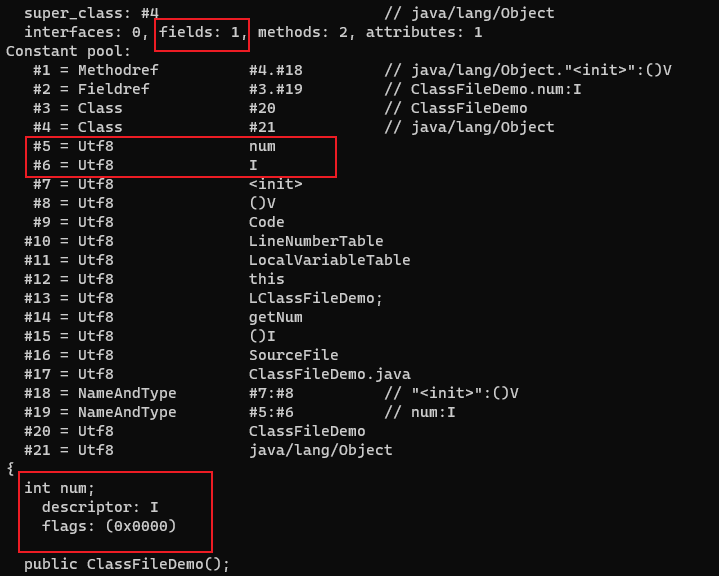

# 字段

接口索引集合之后，是字段个数(fields_count)和字段集合(fields)。字段集合由字段表(field_info)组成。

字段表(field_info)用于描述接口或者类中声明的字段。Java语言中的字段(Field)包括类变量以及实例变量，但不包括在方法内部声明的局部变量。

## 字段表结构



name_index和descriptor_index都是对常量池项的引用，分别代表着字段的简单名称以及字段的描述符。

字段表集合中不会列出从父类或者父接口中继承而来的字段，但有可能会有编译器自动添加的字段。

## 字段访问标志(access_flags)



- ACC_PUBLIC、ACC_PRIVATE、ACC_PROTECTED三个标志最多只能选择其一
- ACC_FINAL、ACC_VOLATILE不能同时选择
- 接口之中的字段必须有ACC_PUBLIC、ACC_STATIC、ACC_FINAL标志

## 字段描述符


对于数组类型，每一维度将使用一个前置的`[`字符来描述，如一个String[][]类型的二维数组将被记录成`[[Ljava/lang/String`，一个整型数组int[]将被记录成`[I`。

---

```java
public class ClassFileDemo {
    int num;

    public int getNum() {
        return this.num;
    }
}
```

字节码文件内容:



字段个数(fields_count)为`0x0001`，即只有一个字段。紧接着是字段表集合。

access_flags为`0x0000`，表示字段没有修饰符。name_index为`0x0005`，指向常量池中索引为5的值`num`。descriptor_index为`0x0006`，指向常量池中索引为6的值`I`。attributes_count为`0x0000`，表示字段没有额外的属性。

使用`javap -verbose ClassFileDemo.class`命令解析class文件，可以对应上字段的内容：


