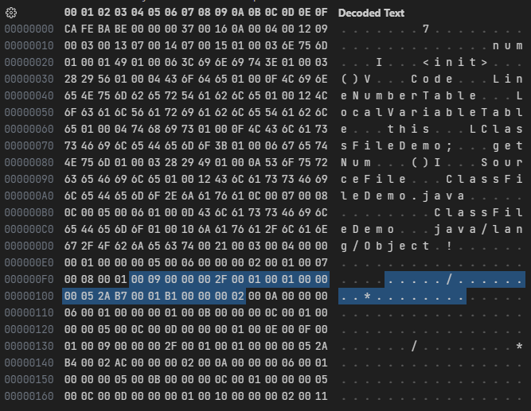
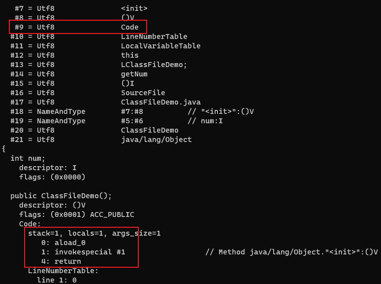
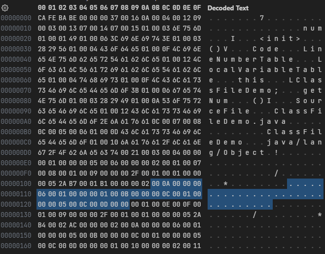
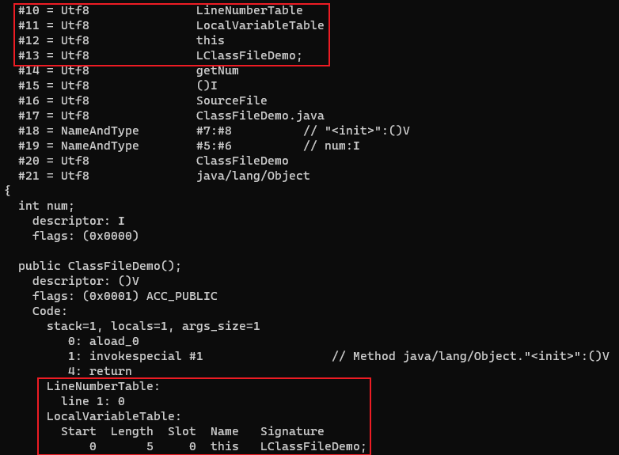
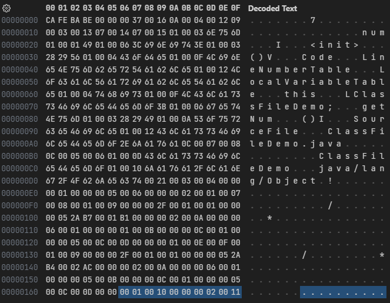
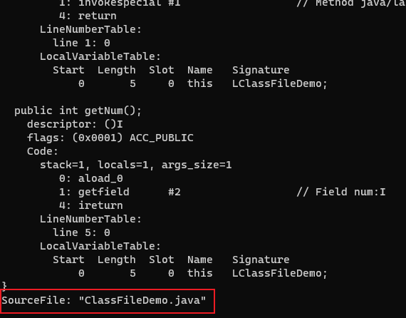

# 属性表

Class文件、字段表、方法表都可以携带自己的属性表集合(attributes)，用来存储它们自己的信息。

对于每一个属性，它的名称都要从常量池中引用一个CONSTANT_Utf8_info类型的常量来表示，而属性值的结构则是完全自定义的，只需要通过一个u4的长度属性去说明属性值所占用的位数即可。

## 属性表的通用结构

| 类型 | 名称               | 数量           |
| ---- | -------------------- | ---------------- |
| u2   | attribute_name_index | 1                |
| u4   | attribute_length     | 1                |
| u1   | 各属性自定义          | attribute_length |

## Code属性表

Code属性表是一种用来存储方法体的属性表。它包含了方法的指令、局部变量表、操作数栈、异常处理器等信息。

| 类型         | 名称                 | 数量                 |
| -------------- | ---------------------- | ---------------------- |
| u2             | attribute_name_index   | 1                      |
| u4             | attribute_length       | 1                      |
| u2             | max_stack              | 1                      |
| u2             | max_locals             | 1                      |
| u4             | code_length            | 1                      |
| u1             | code                   | code_length            |
| u2             | exception_table_length | 1                      |
| exception_info | exception_table        | exception_table_length |
| u2             | attributes_count       | 1                      |
| attribute_info | attributes             | attributes_count       |

- attribute_name_index是一项指向常量池中CONSTANT_Utf8_info型常量的索引，此常量值固定为Code
- attribute_length表示属性值的长度，由于attribute_name_index与attribute_length一共为6个字节，所以属性值的长度固定为整个属性表长度减去6个字节
- max_stack代表了栈帧中操作数栈的最大深度。在方法执行的任意时刻，操作数栈都不会超过这个深度。虚拟机运行的时候需要根据这个值来分配栈帧中的操作数栈深度
- max_locals代表了局部变量表所需的存储空间
- code_length代表字节码指令长度
- code用于存储字节码指令。每个指令是一个u1类型的单字节，当虚拟机读取到code中的一个字节码时，就可以找出这个字节码代表的是什么指令，并且可以知道这条指令后面是否需要跟随参数，以及后续的参数应当如何解析。一个u1类型一共可以表达256条指令，目前已经定义了大约200条指令

---

```java
public class ClassFileDemo {
    int num;

    public int getNum() {
        return this.num;
    }
}
```

字节码文件内容:



attribute_name_index为`0x0009`，指向常量池中索引为9的值`Code`，说明此属性是方法的字节码描述。attribute_length为`0x0000002F`，即十进制的47。

max_stack的值为`0x0001`，max_locals的值也是`0x0001`。code_length为`0x00000005`，所以接下来的5个字节`0x2AB70001B1`就是方法的节码指令。

- `0x2A`表示指令`aload_0`
- `0xB7`表示指令`invokespecial`
- `0x0001`是指令`invokespecial`的操作数，指向常量池中的一个CONSTANT_Methodref_info类型的常量，即此方法的符号引用
- `0xB1`表示指令`return`

exception_table_length为`0x0000`，异常表为空。

接着是attributes_count`0x0002`，表示Code属性表中又包含了两个属性。

使用 javap -verbose ClassFileDemo.class 命令解析class文件：



## LineNumberTable属性

LineNumberTable属性用于描述Java源码行号与字节码行号之间的对应关系。它不是运行时必需的属性，但默认会生成到Class文件之中。如果选择不生成LineNumberTable属性，当抛出异常时，堆栈中将不会显示出错的行号，并且在调试程序的时候，也无法按照源码行来设置断点。

| 类型           | 名称                   | 数量                   |
| ---------------- | ------------------------ | ------------------------ |
| u2               | attribute_name_index     | 1                        |
| u4               | attribute_length         | 1                        |
| u2               | line_number_table_length | 1                        |
| line_number_info | line_number_table        | line_number_table_length |

line_number_table是一个数量为line_number_table_length、类型为line_number_info的集合，line_number_info包含start_pc和line_number两个u2类型的数据项，前者是字节码行号，后者是Java源码行号。

## LocalVariableTable属性

LocalVariableTable属性用于描述栈帧中局部变量表的变量与Java源码中定义的变量之间的关系，它也不是运行时必需的属性，但默认会生成到Class文件之中。如果没有生成这项属性，最大的影响就是当其他人引用这个方法时，所有的参数名称都将会丢失，比如IDE将会使用诸如arg0、arg1之类的占位符代替原有的参数名，这对程序运行没有影响，但是会对代码编写带来较大不便，而且在调试期间无法根据参数名称从上下文中获得参数值。

| 类型              | 名称                      | 数量                      |
| ------------------- | --------------------------- | --------------------------- |
| u2                  | attribute_name_index        | 1                           |
| u4                  | attribute_length            | 1                           |
| u2                  | local_variable_table_length | 1                           |
| local_variable_info | local_variable_table        | local_variable_table_length |

### local_variable_info结构

| 类型 | 名称           | 数量 |
| ---- | ---------------- | ---- |
| u2   | start_pc         | 1    |
| u2   | length           | 1    |
| u2   | name_index       | 1    |
| u2   | descriptor_index | 1    |
| u2   | index            | 1    |

start_pc和length属性分别代表了这个局部变量的生命周期开始的字节码偏移量及其作用范围覆盖的长度，两者结合起来就是这个局部变量在字节码之中的作用域范围。

name_index和descriptor_index都是指向常量池中CONSTANT_Utf8_info型常量的索引，分别代表了局部变量的名称以及这个局部变量的描述符。

index是这个局部变量在栈帧的局部变量表中变量槽的位置。当这个变量数据类型是64位类型时，它占用的变量槽为index和index+1两个。

---



Code属性表中的第一个属性：attribute_name_index为`0x000A`，指向常量池中索引为10的值`LineNumberTable`。attribute_length为`0x00000006`，line_number_table_length为`0x0001`。line_number_info中的start_pc为`0x0000`，line_number为`0x0001`。

Code属性表中的第二个属性：attribute_name_index为`0x000B`，指向常量池中索引为11的值`LocalVariableTable`。attribute_length为`0x0000000C`，local_variable_table_length为`0x0001`。local_variable_info中的start_pc为`0x0000`，length为`0x0005`，name_index为`0x000C`，指向常量池中索引为12的值`this`，descriptor_index为`0x000D`，指向常量池中索引为13的值`LClassFileDemo;`，index为`0x0000`。

使用 javap -verbose ClassFileDemo.class 命令解析class文件：



## SourceFile属性

SourceFile属性用于记录生成这个Class文件的源码文件名称，这个属性也是可选的。在Java中，对于大多数的类来说，类名和文件名是一致的，但是有一些特殊情况(如内部类)例外。如果不生成这项属性，当抛出异常时，堆栈中将不会显示出错代码所属的文件名。

| 类型 | 名称               | 数量 |
| ---- | -------------------- | ---- |
| u2   | attribute_name_index | 1    |
| u4   | attribute_length     | 1    |
| u2   | sourcefile_index     | 1    |

sourcefile_index数据项是指向常量池中CONSTANT_Utf8_info型常量的索引，常量值是源码文件的文件名。

---



方法表结束后，紧接着的attributes_count`0x0001`，表示字节码文件有1个附加属性。

attribute_name_index为`0x0010`，指向常量池中索引为16的值`SourceFile`，说明此属性是这个Class文件的源码文件名称。attribute_length为`0x00000002`。sourcefile_index为`0x0011`，指向常量池中索引为17的值`ClassFileDemo.java`。

使用 javap -verbose ClassFileDemo.class 命令解析class文件：


