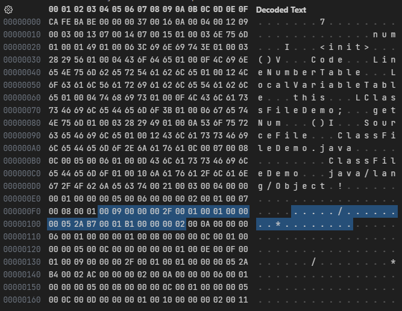
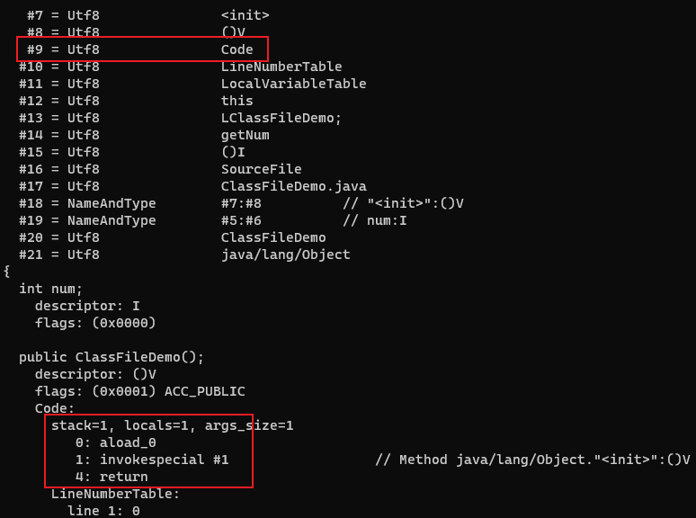

# 属性表

Class文件、字段表、方法表都可以携带自己的属性表集合(attribute_info)，以描述某些场景专有的信息。

对于每一个属性，它的名称都要从常量池中引用一个CONSTANT_Utf8_info类型的常量来表示，而属性值的结构则是完全自定义的，只需要通过一个u4的长度属性去说明属性值所占用的位数即可。

属性表结构：

| 类型 | 名称               | 数量           |
| ---- | -------------------- | ---------------- |
| u2   | attribute_name_index | 1                |
| u4   | attribute_length     | 1                |
| u1   | info                 | attribute_length |

---

Code属性表的结构：

| 类型         | 名称                 | 数量                 |
| -------------- | ---------------------- | ---------------------- |
| u2             | attribute_name_index   | 1                      |
| u4             | attribute_length       | 1                      |
| u2             | max_stack              | 1                      |
| u2             | max_locals             | 1                      |
| u4             | code_length            | 1                      |
| u1             | code                   | code_length            |
| u2             | exception_table_length | 1                      |
| exception_info | exception_table        | exception_table_length |
| u2             | attributes_count       | 1                      |
| attribute_info | attributes             | attributes_count       |

attribute_name_index是一项指向常量池中CONSTANT_Utf8_info型常量的索引，此常量值固定为Code，attribute_length表示属性值的长度，由于attribute_name_index与attribute_length一共为6个字节，所以属性值的长度固定为整个属性表长度减去6个字节。

max_stack代表了栈帧中操作数栈的最大深度。在方法执行的任意时刻，操作数栈都
不会超过这个深度。虚拟机运行的时候需要根据这个值来分配栈帧中的操作栈深度。

max_locals代表了局部变量表所需的存储空间。

code_length代表字节码长度，code用于存储字节码指令。每个指令是一个u1类型的单字节，当虚拟机读取到code中的一个字节码时，就可以找出这个字节码代表的是什么指令，并且可以知道这条指令后面是否需要跟随参数，以及后续的参数应当如何解析。一个u1类型一共可以表达256条指令，目前已经定义了大约200条指令。

---

```java
public class ClassFileDemo {
    int num;

    public int getNum() {
        return this.num;
    }
}
```

字节码文件内容:



attribute_name_index为`0x0009`，指向常量池中索引为9的值`Code`，说明此属性是方法的字节码描述。attribute_length为`0x0000002F`，即十进制的47。

max_stack的值为`0x0001`，max_locals的值也是`0x0001`。code_length为`0x00000005`，后面的5个字节`0x2AB70001B1`就是方法的节码指令。

`0x2A`表示指令`aload_0`。`0xB7`表示指令`invokespecial`，`0x0001`是指令`invokespecial`的操作数，指向常量池中的一个CONSTANT_Methodref_info类型的常量，即此方法的符号引用。`0xB1`表示指令`return`。

exception_table_length为`0x0000`，由于没有exception_table，所以紧接着是attributes_count`0x0002`，表示Code属性表中又包含了两个属性。

使用`javap -verbose ClassFileDemo.class`命令解析class文件，可以对应上方法的内容：



---

LineNumberTable属性


Code属性表中的第一个属性：attribute_name_index为`0x000A`，指向常量池中索引为10的值`LineNumberTable`。

