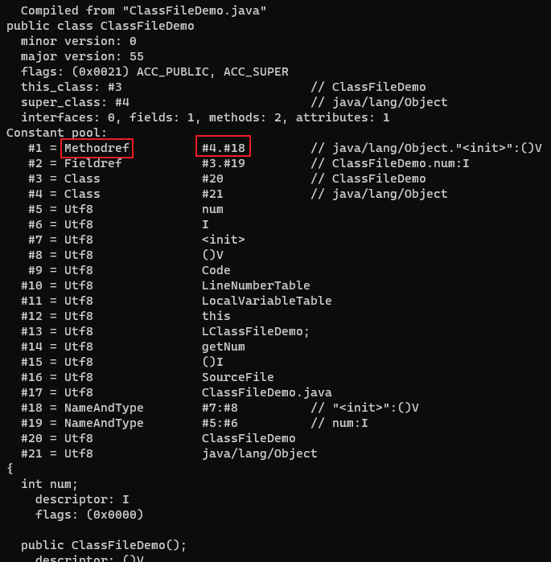

# 常量池

紧接着主、次版本号之后的是常量池入口，由于常量池中常量的数量是不固定的，所以在常量池的入口需要放置一项u2类型的数据，代表常量池的容量(constant_pool_count)，这个容量计数是从1而不是0开始的。如果后面某些指向常量池的索引值的数据在特定情况下需要表达不引用任何一个常量池项目，可以把索引值设置为0来表示。

常量池中主要存放两大类常量：字面量(Literal)和符号引用(Symbolic References)。

- 字面量比较接近于Java的常量概念，如文本字符串、被声明为final的常量值等
- 符号引用主要包括：被模块导出或者开放的包、类和接口的全限定名、字段的名称和描述符、方法的名称和描述符、方法句柄和方法类型、动态调用点和动态常量

Java代码在进行编译的时候，并不像C和C++那样有链接这一步骤，而是在虚拟机加载Class文件的时候进行动态连接。在Class文件中不会保存各个方法、字段最终在内存中的信息。当虚拟机做类加载时，将会从常量池获得对应的符号引用，再在类创建或运行时解析、翻译到具体的内存地址之中。

常量池中每一项常量都是一个表，常量表中分别有17种不同类型的常量。表结构起始的第一位是个u1类型的标志位，代表着当前常量属于哪种常量类型。这17种常量类型各自有着完全独立的数据结构。

## 常量池的项目类型

## 常量池中的17种数据类型的结构

---

字节码文件内容:

常量池容量为`0x0016`，即十进制的22，代表常量池中有21项常量，索引值范围为1～21。

常量池的第一项常量，它的标志位是`0x0A`，即十进制的10，对应的常量是CONSTANT_Methodref_info类型，此类型的常量代表一个类中方法的符号引用。CONSTANT_Methodref_info类型的结构是：tag+index+index。所以紧接着标志位的是指向声明方法的类描述符CONSTANT_Class info的索引项`0x0004`，即十进制的4。再后面是指向名称及类型描述符CONSTANT_NameAndType_info的索引项`0x0012`，即十进制的18。

使用`javap -verbose ClassFileDemo.class`命令解析class文件，可以对应上第一项常量的内容：

