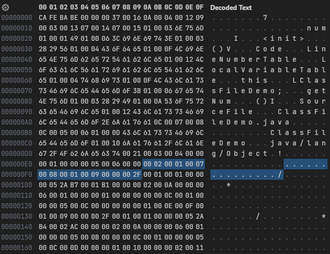
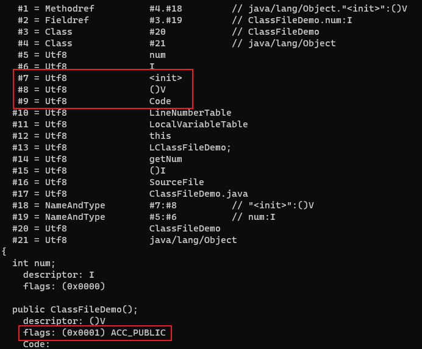
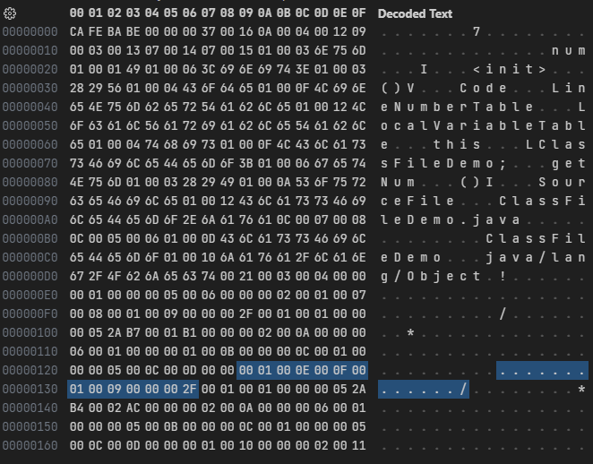
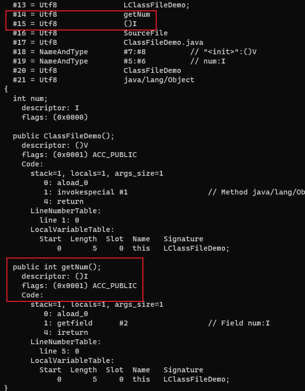

# 方法

字段集合之后，是方法个数(methods_count)和方法集合(methods)。方法集合由方法表(method_info)组成。

## 方法表结构

| 类型         | 名称           | 数量           |
| -------------- | ---------------- | ---------------- |
| u2             | access_flags     | 1                |
| u2             | name_index       | 1                |
| u2             | descriptor_index | 1                |
| u2             | attributes_count | 1                |
| attribute_info | attributes       | attributes_count |

## 方法访问标志(access_flags)

| 标志           | 值    | 说明                         |
| ---------------- | ------ | ------------------------------ |
| ACC_PUBLIC       | 0x0001 | 方法是否public             |
| ACC_PRIVATE      | 0x0002 | 方法是否private            |
| ACC_PROTECTED    | 0x0004 | 方法是否protected          |
| ACC_STATIC       | 0x0008 | 方法是否static             |
| ACC_FINAL        | 0x0010 | 方法是否final              |
| ACC_SYNCHRONIZED | 0x0020 | 方法是否为synchronized    |
| ACC_BRIDGE       | 0x0040 | 方法是否为编译器产生的桥接方法 |
| ACC_VARARGS      | 0x0080 | 方法是否接受不定参数 |
| ACC_NATIVE       | 0x0100 | 方法是否为native          |
| ACC_ABSTRACT     | 0x0400 | 方法是否为abstract        |
| ACC_STRICT       | 0x0800 | 方法是否为strictfp        |
| ACC_SYNTHETIC    | 0x1000 | 方法是否由编译器自动产生 |

## 方法描述符

| 标识字符 | 说明                        |
| -------- | ----------------------------- |
| B        | 基本类型byte              |
| C        | 基本类型char              |
| D        | 基本类型double            |
| F        | 基本类型float             |
| I        | 基本类型int               |
| J        | 基本类型long              |
| S        | 基本类型short             |
| Z        | 基本类型boolean           |
| V        | 特殊类型void              |
| L        | 对象类型，如Ljava/lang/Object |

用描述符来描述方法时，按照先参数列表、后返回值的顺序描述，参数列表按照参数的顺序放在一组小括号之内。

- 方法`void inc()`的描述符为`()V`
- 方法`String toString()`的描述符为`()Ljava/lang/String`
- 方法`int indexOf(char[]source,int sourceOffset,int sourceCount,char[]target,int targetOffset,int targetCount,int fromIndex)`的描述符为`([CII[CIII)I`

方法的定义可以通过访问标志、名称索引、描述符索引来表达清楚，而方法里面的代码经过编译后，存放在方法属性表集合(attributes)中一个名为Code的属性(attribute_info)里面。

如果父类方法在子类中没有被重写，方法表集合中就不会出现来自父类的方法信息。但有可能会出现由编译器自动添加的方法，最常见的便是类构造器`<clinit>()`方法和实例构造器`<init>()`方法。

---

```java
public class ClassFileDemo {
    int num;

    public int getNum() {
        return this.num;
    }
}
```

字节码文件内容:



方法个数(methods_count)为`0x0002`，即有2个方法。紧接着是方法表集合。

第一个方法：access_flags为`0x0001`，表示修饰符为`ACC_PUBLIC`。name_index为`0x0007`，指向常量池中索引为7的值`<init>`。descriptor_index为`0x0008`，指向常量池中索引为8的值`()V`。attributes_count为`0x0001`，表示此方法的属性表集合有1项属性，紧接着的是attribute_info，其中的属性名称的索引值为`0x0009`，指向常量池中索引为9的值`Code`，说明此属性是方法的字节码描述。后面的4个字节`0x0000002F`表示属性`Code`的长度，即十进制的47。

使用`javap -verbose ClassFileDemo.class`命令解析class文件，可以对应上方法的内容：



---

从`0x0000002F`开始47个字节后，是第二个方法的内容。



第二个方法：access_flags为`0x0001`，表示修饰符为`ACC_PUBLIC`。name_index为`0x000E`，指向常量池中索引为14的值`getNum`。descriptor_index为`0x000F`，指向常量池中索引为15的值`()I`。attributes_count为`0x0001`，表示此方法的属性表集合有1项属性，紧接着的是attribute_info，其中的属性名称的索引值为`0x0009`，指向常量池中索引为9的值`Code`，说明此属性是方法的字节码描述。后面的4个字节`0x0000002F`表示属性`Code`的长度，即十进制的47。

使用`javap -verbose ClassFileDemo.class`命令解析class文件：


