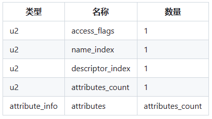
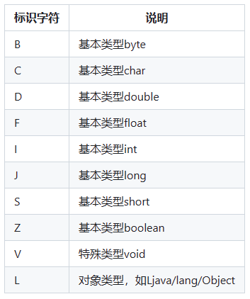
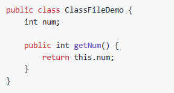
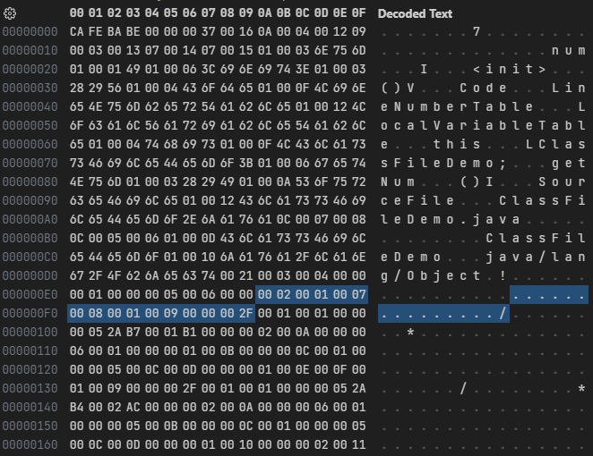
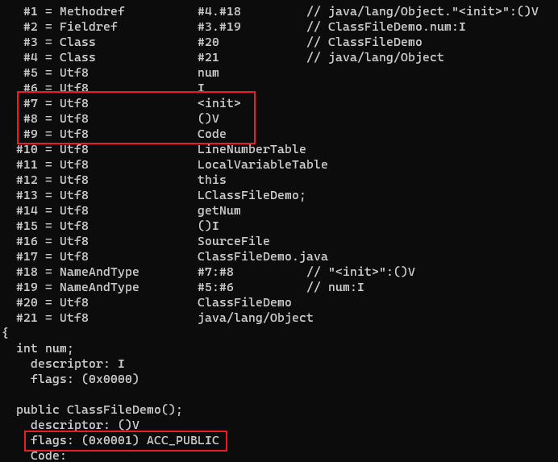
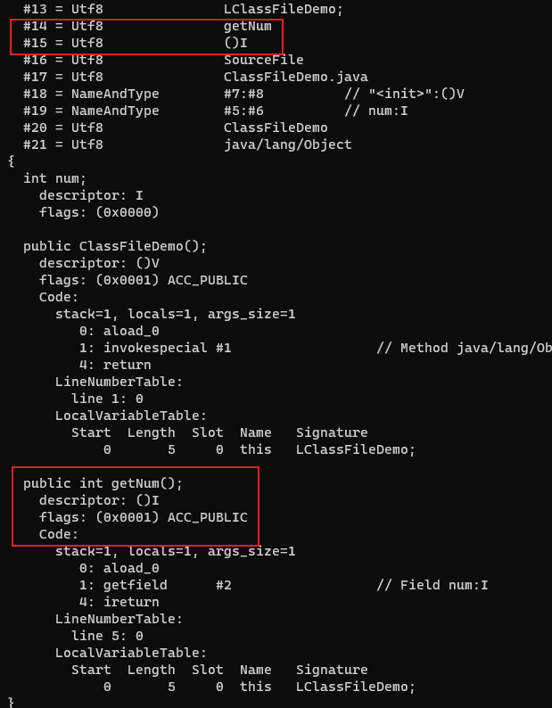

# 方法

字段集合之后, 是方法个数(methods_count)和方法集合(methods)。方法集合由方法表(method_info)组成。

## 方法表结构

## 方法访问标志(access_flags)

## 方法描述符

用描述符来描述方法时, 按照先参数列表、后返回值的顺序描述, 参数列表按照参数的顺序放在一组小括号之内。

- 方法`void inc()`的描述符为`()V`
- 方法`String toString()`的描述符为`()Ljava/lang/String`
- 方法`int indexOf(char[]source,int sourceOffset,int sourceCount,char[]target,int targetOffset,int targetCount,int fromIndex)`的描述符为`([CII[CIII)I`

方法的定义可以通过访问标志、名称索引、描述符索引来表达清楚, 而方法里面的代码经过编译后, 存放在方法属性表集合(attributes)中一个名为Code的属性(attribute_info)里面。

如果父类方法在子类中没有被重写, 方法表集合中就不会出现来自父类的方法信息。但有可能会出现由编译器自动添加的方法, 最常见的便是类构造器`<clinit>()`方法和实例构造器`<init>()`方法。

---

字节码文件内容:

方法个数(methods_count)为`0x0002`, 即有2个方法。紧接着是方法表集合。

第一个方法: access_flags为`0x0001`, 表示修饰符为`ACC_PUBLIC`。name_index为`0x0007`, 指向常量池中索引为7的值`<init>`。descriptor_index为`0x0008`, 指向常量池中索引为8的值`()V`。attributes_count为`0x0001`, 表示此方法的属性表集合有1项属性, 紧接着的是attribute_info, 其中的属性名称的索引值为`0x0009`, 指向常量池中索引为9的值`Code`, 说明此属性是方法的字节码描述。后面的4个字节`0x0000002F`表示属性`Code`的长度, 即十进制的47。

使用 javap -verbose ClassFileDemo.class 命令解析class文件, 可以对应上方法的内容: 

---

从`0x0000002F`开始47个字节后, 是第二个方法的内容。

第二个方法: access_flags为`0x0001`, 表示修饰符为`ACC_PUBLIC`。name_index为`0x000E`, 指向常量池中索引为14的值`getNum`。descriptor_index为`0x000F`, 指向常量池中索引为15的值`()I`。attributes_count为`0x0001`, 表示此方法的属性表集合有1项属性, 紧接着的是attribute_info, 其中的属性名称的索引值为`0x0009`, 指向常量池中索引为9的值`Code`, 说明此属性是方法的字节码描述。后面的4个字节`0x0000002F`表示属性`Code`的长度, 即十进制的47。

使用 javap -verbose ClassFileDemo.class 命令解析class文件: 

