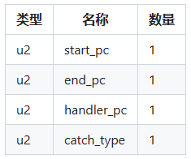

# 显式异常处理表

Code属性表中，在字节码指令之后的是这个方法的显式异常处理表exception_table，异常表对于Code属性来说并不是必须存在的。

显式异常处理表结构：



catch_type为指向一个CONSTANT_Class_info型常量的索引。

如果当字节码从第start_pc行到第end_pc行之间(不含第end_pc行)出现了类型为catch_type或者其子类的异常，则转到第handler_pc行继续处理。当catch_type的值为0时，代表任意异常情况都需要转到handler_pc处进行处理。

```java
public class ExceptionTableDemo {
    public int inc() {
        int x;
        try {
            x = 1;
            return x;
        } catch (Exception e) {
            x = 2;
            return x;
        } finally {
            x = 3;
        }
    }
}
```

如果没有出现异常，返回值是1。如果出现了Exception异常，返回值是2。如果出现了Exception以外的异常，方法非正常退出，没有返回值。

使用`javap -verbose ExceptionTableDemo.class`命令解析class文件：


字节码中第0到3行所做的操作就是将整数1赋值给变量x，并且将此时x的值复制一份副本到本地变量表的变量槽中，这个变量槽里面的值在ireturn指令执行前将会被重新读到操作栈顶，作为方法返回值使用。

如果这时候没有出现异常，则会继续执行第4到7行，将变量x赋值为3，然后将之前保存的返回值1读入到操作栈顶，最后ireturn指令会以int形式返回操作栈顶中的值，方法结束。

如果出现了Exception异常，程序计数器指针转到第8行，第8到16行所做的事情是将2赋值给变量x，然后将变量x此时的值存储为返回值，最后再将变量x的值改为3。方法返回前同样将返回值2读到了操作栈顶。

如果出现了Exception以外的异常，程序计数器指针转到第17行代码，将变量x的值赋为3，并将栈顶的异常抛出，方法结束。
