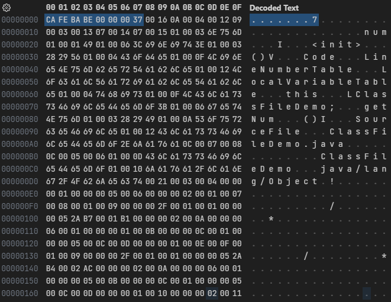

# 类文件结构

Class文件是一组以8个字节为基础单位的二进制流，各个数据项目严格按照顺序紧凑地排列在文件之中，中间没有添加任何分隔符，这使得整个Class文件中存储的内容几乎全部是程序运行的必要数据，没有空隙存在。当遇到需要占用8个字节以上空间的数据项时，则会按照高位在前的方式分割成若干个8个字节进行存储。

数据的高位和低位：数据的高位是数据的左边位置的数，数据的低位是数据右边位置的数，数据的高位和低位又称高字节和低字节。拿一个十进制数来讲，例如1234，那么1是1234的高位，4是数据的低位。

Class文件格式采用一种类似于C语言结构体的伪结构来存储数据，这种伪结构中只有两种数据类型：无符号数和表。

- 无符号数属于基本的数据类型，以u1、u2、u4、u8来分别代表1个字节、2个字节、4个字节和8个字节的无符号数，无符号数可以用来描述数字、索引引用、数量值或者按照UTF-8编码构成字符串值
- 表是由多个无符号数或者其他表作为数据项构成的复合数据类型，为了便于区分，所有表的命名都习惯性地以_info结尾。表用于描述有层次关系的复合结构的数据，整个Class文件本质上也可以视作是一张表

| 类型         | 名称              | 说明       | 长度  |
| -------------- | ------------------- | ------------ | ------- |
| u4             | magic               | 魔数       | 4个字节 |
| u2             | minor_version       | 副版本号 | 2个字节 |
| u2             | major_version       | 主版本号 | 2个字节 |
| u2             | constant_pool_count | 常量池容量 | 2个字节 |
| cp_info        | constant_pool       | 常量池    | n个字节 |
| u2             | access_flags        | 访问标志 | 2个字节 |
| u2             | this_class          | 类索引    | 2个字节 |
| u2             | super_class         | 父类索引 | 2个字节 |
| u2             | interfaces_count    | 接口个数 | 2个字节 |
| u2             | interfaces          | 接口索引集合 | n个字节 |
| u2             | fields_count        | 字段个数 | 2个字节 |
| field_info     | fields              | 字段集合 | n个字节 |
| u2             | methods_count       | 方法个数 | 2个字节 |
| method_info    | methods             | 方法集合 | n个字节 |
| u2             | attributes_count    | 附加属性个数 | 2个字节 |
| attribute_info | attributes          | 附加属性集合 | n个字节 |

---

```java
public class ClassFileDemo {
    int num;

    public int getNum() {
        return this.num;
    }
}
```

字节码文件内容:



每个Class文件的头4个字节被称为魔数(Magic Number)，它的唯一作用是确定这个文件是否为一个能被虚拟机接受的Class文件，固定为`0xCAFEBABE`。

紧接着魔数的4个字节存储的是Class文件的版本号：第5和第6个字节是副版本号(Minor
Version)，第7和第8个字节是主版本号(Major Version)。

Java的版本号是从45开始的，JDK 1.1之后的每个JDK大版本发布主版本号向上加1，高版本的JDK能向下兼容以前版本的Class文件，但不能运行以后版本的Class文件。

示例中的版本号`0x0000`和`0x0037`转换成十进制是55.0，即Java 11。
