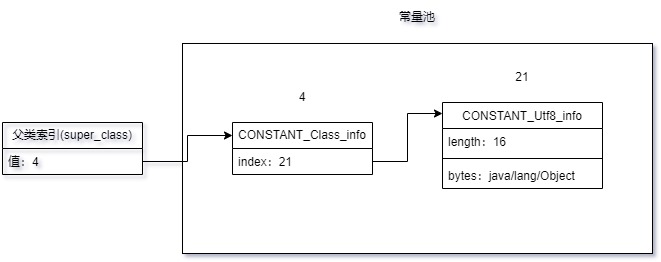
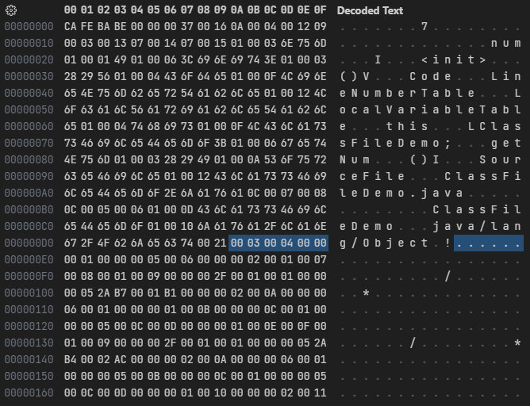
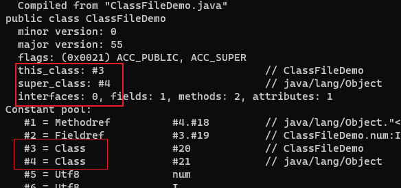

# 索引

在访问标志之后，是类索引(this_class)、父类索引(super_class)、接口个数(interfaces_count)和接口索引集合(interfaces)。

类索引和父类索引都是一个 u2 类型的数据，而接口索引集合是**一组**u2 类型的数据，Class 文件中由这三项数据来确定该类型的继承关系。

类索引用于确定这个类的全限定名，父类索引用于确定这个类的父类的全限定名。他们的索引值都指向 CONSTANT_Class_info 类型的常量，通过 CONSTANT_Class_info 类型的常量中的索引值可以找到定义在 CONSTANT_Utf8_info 类型的常量中的全限定名字符串。



由于 Java 语言不允许多重继承，所以父类索引只有一个，除了 java.lang.Object 之外，所有 Java 类的父类索引都不为 0。

接口索引集合用来描述这个类实现了哪些接口，这些被实现的接口将按 implements 关键字(如果这个字节码文件表示的是一个接口，则是 extends 关键字)后的接口顺序从左到右排列在接口索引集合中。

接口个数是一个 u2 类型的数据，表示接口索引表的容量。如果该类没有实现任何接口，则接口个数值为 0，后面的接口索引集合不再占用任何字节。如果实现了接口，则接口索引集合中会有一组接口索引，每个接口索引占 2 个字节，指向常量池中的 CONSTANT_Class_info 常量。

---

```java
public class ClassFileDemo {
    int num;

    public int getNum() {
        return this.num;
    }
}
```

字节码文件内容:



类索引为`0x0003`，指向常量池中索引为 3 的值`ClassFileDemo`。父类索引为`0x0004`，指向常量池中索引为 4 的值`java/lang/Object`。接口个数为`0x0000`，即没有实现任何接口。

使用 javap -verbose ClassFileDemo.class 命令解析 class 文件，可以对应上类索引、父类索引和接口索引的内容：


