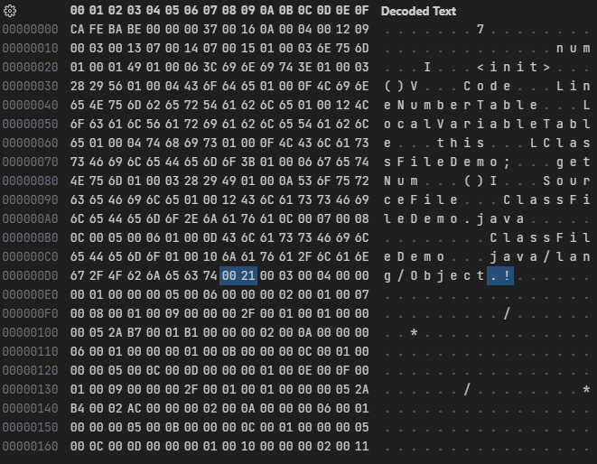
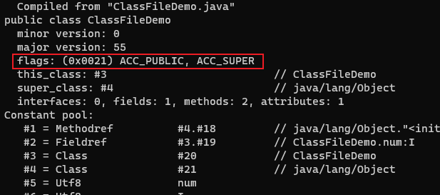

# 访问标志

在常量池结束之后，紧接着的 2 个字节代表访问标志(access_flags)，这个标志用于识别一些类或者接口层次的访问信息，包括：这个 Class 是类还是接口、是否定义为 public 类型、是否定义为 abstract 类型、如果是类的话，是否被声明为 final 等等。

| 标志名称       | 标志值 | 说明                                                                                         |
| -------------- | ------ | -------------------------------------------------------------------------------------------- |
| ACC_PUBLIC     | 0x0001 | 是否为 public 类型                                                                           |
| ACC_FINAL      | 0x0010 | 是否被声明为 final，只有类可设置                                                             |
| ACC_SUPER      | 0x0020 | 是否允许使用 invokevirtual 字节码指令的新语义，JDK1.0.2 之后编译出来的类的这个标志都必须为真 |
| ACC_INTERFACE  | 0x0200 | 标识这是一个接口                                                                             |
| ACC_ABSTRACT   | 0x0400 | 是否为 abstract 类型，对于接口或者抽象类来说，此标志值为真，其他类型值为假                   |
| ACC_SYNTHETIC  | 0x1000 | 标识这个类并非由用户代码产生的                                                               |
| ACC_ANNOTATION | 0x2000 | 标识这是一个注解                                                                             |
| ACC_ENUM       | 0x4000 | 标识这是一个枚举                                                                             |
| ACC_MODULE     | 0x8000 | 标识这是一个模块                                                                             |

access_flags 中一共有 16 个标志位可以使用，当前只定义了其中 9 个，没有使用到的标志位要求一律为零。

如果一个类既是 public 的，又是 final 的，而且使用 JDK8 编译，那么它的访问标志就是`0x0001`+`0x0010`+`0x0020`+`0x0000`+`0x0000`+`0x0000`+`0x0000`+`0x0000`+`0x0000`=`0x0031`。

---

```java
public class ClassFileDemo {
    int num;

    public int getNum() {
        return this.num;
    }
}
```

字节码文件内容:



ClassFileDemo 是一个普通 Java 类，不是接口、枚举、注解或者模块，被 public 关键字修饰但没有被声明为 final 和 abstract，并且它使用了 JDK 1.2 之后的编译器进行编译，因此它的 ACC_PUBLIC、ACC_SUPER 标志应当为真，而 ACC_FINAL、ACC_INTERFACE、ACC_ABSTRACT、ACC_SYNTHETIC、ACC_ANNOTATION、ACC_ENUM、ACC_MODULE 这七个标志应当为假，因此它的访问标志的值是`0x0001`+`0x0000`+`0x0020`+`0x0000`+`0x0000`+`0x0000`+`0x0000`+`0x0000`+`0x0000`=`0x0021`。

使用 javap -verbose ClassFileDemo.class 命令解析 class 文件，可以对应上访问标志的内容：


