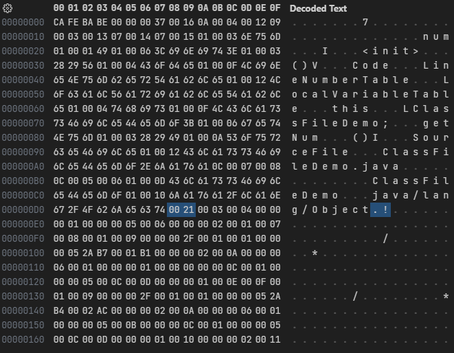
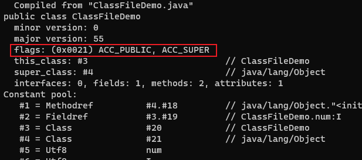

# 访问标志

在常量池结束之后，紧接着的2个字节代表访问标志(access_flags)，这个标志用于识别一些类或者接口层次的访问信息，包括：这个Class是类还是接口、是否定义为public类型、是否定义为abstract类型、如果是类的话，是否被声明为final等等。


access_flags中一共有16个标志位可以使用，当前只定义了其中9个，没有使用到的标志位要求一律为零。

如果一个类既是public的，又是final的，而且使用JDK8编译，那么它的访问标志就是`0x0001`+`0x0010`+`0x0020`+`0x0000`+`0x0000`+`0x0000`+`0x0000`+`0x0000`+`0x0000`=`0x0031`。

---

```java
public class ClassFileDemo {
    int num;

    public int getNum() {
        return this.num;
    }
}
```

字节码文件内容:



ClassFileDemo是一个普通Java类，不是接口、枚举、注解或者模块，被public关键字修饰但没有被声明为final和abstract，并且它使用了JDK 1.2之后的编译器进行编译，因此它的ACC_PUBLIC、ACC_SUPER标志应当为真，而ACC_FINAL、ACC_INTERFACE、ACC_ABSTRACT、ACC_SYNTHETIC、ACC_ANNOTATION、ACC_ENUM、ACC_MODULE这七个标志应当为假，因此它的访问标志的值是`0x0001`+`0x0000`+`0x0020`+`0x0000`+`0x0000`+`0x0000`+`0x0000`+`0x0000`+`0x0000`=`0x0021`。

使用`javap -verbose ClassFileDemo.class`命令解析class文件，可以对应上访问标志的内容：


