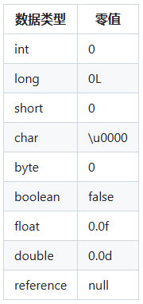

# 准备

准备(Preparation)阶段是是连接阶段(Linking)的第二步，它是为类中的静态变量分配内存并设置初始零值的阶段。在准备阶段进行内存分配的仅包括类变量，而不包括实例变量，实例变量将会在对象实例化时随着对象一起分配在Java堆中。

类变量只在理论上是存储于方法区中的。在JDK 7之前，HotSpot使用永久代来实现方法区，类变量存储在永久代中。但从JDK 7开始，类变量改为随着Class对象一起存放在Java堆中。

假设一个类变量的定义为：

```java
public static int value = 123;
```

那变量value在准备阶段过后的初始值为0而不是123，因为这时尚未开始执行任何Java方法，而把value赋值为123的putstatic指令是程序被编译后，存放于类构造器`<clinit>()`方法之中，所以把value赋值为123的动作要到类的初始化阶段才会被执行。

基本数据类型的零值：



特殊情况：静态常量(使用static+final修饰)，且使用字面量显式赋值时，会在准备阶段进行显式赋值，而不是零值。

```java
public class LinkingTest {
    // 准备阶段赋值为100
    public static final int num0 = 100;
    // 准备阶段赋值为"helloworld"
    public static final String s0 = "helloworld";
    
    // 准备阶段赋值为0。没有final修饰，所以设置为零值
    private static int num1 = 100;
    // 准备阶段赋值为null。使用了String的构造方法，所以设置为零值
    public static final String s1 = new String("helloworld1"); 
}
```
