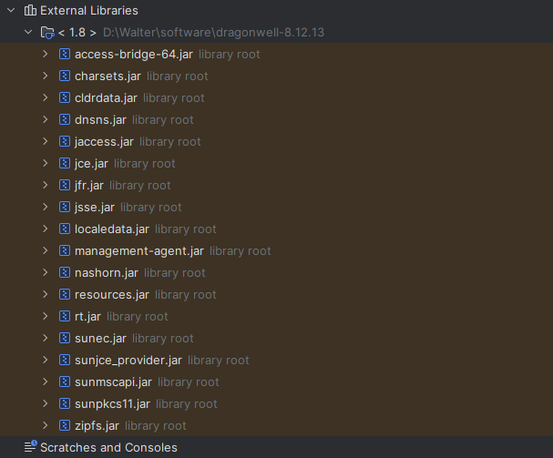
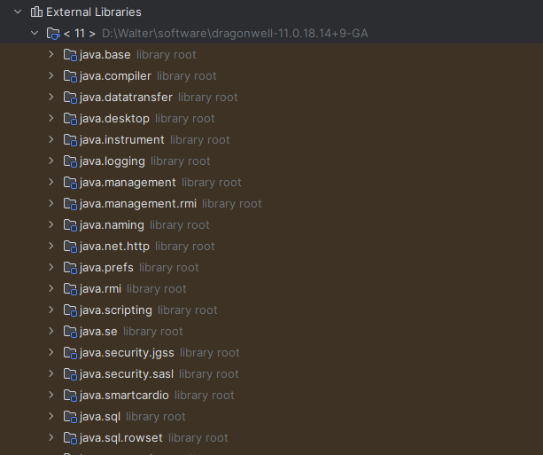

# Java模块化系统

在JDK 9中引入了Java模块化系统(Java Platform Module System，JPMS)。在JDK 9之前，Java平台是以JAR包的形式发布的，这些JAR包之间没有依赖关系，可以随意地混用。JDK 9引入了模块化系统之后，Java平台被划分为若干个模块，每个模块有自己的依赖关系和加载顺序。模块化系统使得Java平台变得灵活、稳定和易于维护。

在JDK 9之前，Java是通过不同的package和jar来做功能的区分和隔离的：



从JDK 9开始，原有的Java标准库已经由一个单一巨大的rt.jar分拆成了几十个模块(如java.base、java.compiler等模块)，这些模块以.jmod扩展名标识，每个模块都包含了一个描述模块的module-info.class文件，这个文件由项目根目录中的源代码文件module-info.java编译而来。



java.base模块比较特殊，它并不依赖于其他任何模块，并且java.base是其他模块的基础，所以在其他模块中并不需要显式引用java.base。

## 创建模块

一个jar包中可以有多个模块，一个模块中可以有多个package。每个模块通过requires和exports关键字，对自身所依赖(requires)的模块和自身暴露(exports)出去的内容(package)进行了声明。本模块只能使用其他模块暴露出来的内容，其他模块也只能使用本模块暴露出去的内容。

创建一个JDK 9模块，只需要创建一个module-info.java文件，并将其放在项目的根目录中：


service模块的module-info.java：

```java
// 声明该模块的名称
module org.xxx.service {
    // 使用exports声明该模块要对外暴露的包
    exports org.example.service;
}
```

controller模块的module-info.java：

```java
// 声明该模块的名称
module org.xxx.controller {
    // 使用requires依赖其他模块
    requires org.xxx.service;
}
```

在controller中使用service模块：

```java
package org.example.controller;

// 使用org.xxx.service模块中暴露的包
import org.example.service.DemoService;

public class DemoController {

    public static void main(String[] args) {
        DemoService service = new DemoService();
        service.test();
    }
}
```

## 运行

```
java --module-path controller\target;service\target --module org.xxx.controller/org.example.controller.DemoController
```
