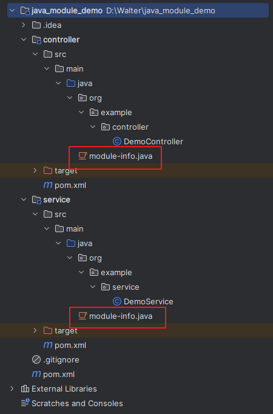

# Java 模块化系统

在 JDK 9 中引入了 Java 模块化系统(Java Platform Module System, JPMS)。在 JDK 9 之前, Java 平台是以 JAR 包的形式发布的, 这些 JAR 包之间没有依赖关系, 可以随意地混用。JDK 9 引入了模块化系统之后, Java 平台被划分为若干个模块, 每个模块有自己的依赖关系和加载顺序。模块化系统使得 Java 平台变得灵活、稳定和易于维护。

在 JDK 9 之前, Java 是通过不同的 package 和 jar 来做功能的区分和隔离的。从 JDK 9 开始, 原有的 Java 标准库已经由一个单一巨大的 rt.jar 分拆成了几十个模块(如 java.base、java.compiler 等模块), 这些模块以.jmod 扩展名标识, 每个模块都包含了一个描述模块的 module-info.class 文件, 这个文件由项目根目录中的源代码文件 module-info.java 编译而来。

java.base 模块比较特殊, 它并不依赖于其他任何模块, 并且 java.base 是其他模块的基础, 所以在其他模块中并不需要显式引用 java.base。

## 创建模块

一个 jar 包中可以有多个模块, 一个模块中可以有多个 package。每个模块通过 requires 和 exports 关键字, 对自身所依赖(requires)的模块和自身暴露(exports)出去的内容(package)进行了声明。本模块只能使用其他模块暴露出来的内容, 其他模块也只能使用本模块暴露出去的内容。

创建一个 JDK 9 模块, 只需要创建一个 module-info.java 文件, 并将其放在项目的根目录中:



service 模块的 module-info.java:

```java
// 声明该模块的名称
module org.xxx.service {
    // 使用exports声明该模块要对外暴露的包
    // 可以被直接引入和反射使用
    exports org.example.service;
}
```

controller 模块的 module-info.java:

```java
// 声明该模块的名称
module org.xxx.controller {
    // 使用requires依赖其他模块
    requires org.xxx.service;
    // 使用opens声明该模块要对外暴露的包
    // 只能被反射调用
    opens org.example.controller;
}
```

在 controller 中使用 service 模块:

```java
package org.example.controller;

// 使用org.xxx.service模块中暴露的包
import org.example.service.DemoService;

public class DemoController {

    public static void main(String[] args) {
        DemoService service = new DemoService();
        service.test();
    }
}
```

## 运行

```sh
java --module-path controller\target;service\target --module org.xxx.controller/org.example.controller.DemoController
```
