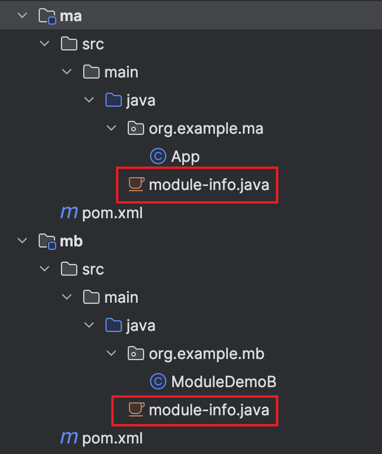

# 使用模块

创建一个 JDK 9 模块, 只需要创建一个模块描述文件(module-info.java), 并将其放在项目的根目录中:



## module-info.java

所有的模块都位于一个全局命名空间中, 因此, 模块的名称必须是唯一的。与包名一样, 可以使用反向域名(例如 com.example.module1)来确保模块的唯一性。模块描述符始终以关键字 module 开头，后跟模块名称。而 module-info.java 的主体描述了模块的其它内容。

模块对于其它模块的依赖关系必须在模块描述符中表示。声明依赖关系使用关键字 requires, 然后紧跟模块名称。所有模块都会默认依赖 java.base, 所以无需手动导入 java.base 模块, 就像无需导入 java.lang.String 包一样。

模块描述符还可以包含 exports 语句, 只有显式地导出一个包时, 其他模块才可以访问这个包。

```java
// 模块名称: org.demo.jpms.ma
module org.demo.jpms.ma {
    // 依赖 org.demo.jpms.mb 模块
    requires org.demo.jpms.mb;
    // 其它模块可以访问 org.example.ma 包
    exports org.example.ma;
}
```

## 对 public 关键字的影响

在 JDK 9 之前，如果有一个 public 的类或接口，那么其他类就可以对它进行访问。但在 JDK 9 之后, public 意味着仅对模块中的其他包公开。只有当 public 的类型被导出后, 其他模块才可以使用这些类型。

## 创建模块化项目

1. 父 pom:

   ```xml
   <project
       xmlns="http://maven.apache.org/POM/4.0.0"
       xmlns:xsi="http://www.w3.org/2001/XMLSchema-instance"
       xsi:schemaLocation="http://maven.apache.org/POM/4.0.0
       http://maven.apache.org/xsd/maven-4.0.0.xsd">
   <modelVersion>4.0.0</modelVersion>

   <groupId>org.example</groupId>
   <artifactId>jpms_demo1</artifactId>
   <version>1.0-SNAPSHOT</version>
   <packaging>pom</packaging>

   <modules>
       <module>ma</module>
       <module>mb</module>
   </modules>

   <properties>
       <project.build.sourceEncoding>UTF-8</project.build.sourceEncoding>
   </properties>

   <build>
       <plugins>
       <plugin>
           <groupId>org.apache.maven.plugins</groupId>
           <artifactId>maven-compiler-plugin</artifactId>
           <version>3.12.1</version>
           <configuration>
           <source>21</source>
           <target>21</target>
           </configuration>
       </plugin>
       </plugins>
   </build>
   </project>
   ```

2. 模块 mb 的 pom:

   ```xml
   <project
       xmlns="http://maven.apache.org/POM/4.0.0"
       xmlns:xsi="http://www.w3.org/2001/XMLSchema-instance"
       xsi:schemaLocation="http://maven.apache.org/POM/4.0.0
       http://maven.apache.org/xsd/maven-4.0.0.xsd">
       <modelVersion>4.0.0</modelVersion>
       <parent>
           <groupId>org.example</groupId>
           <artifactId>jpms_demo1</artifactId>
           <version>1.0-SNAPSHOT</version>
       </parent>

       <artifactId>mb</artifactId>
       <packaging>jar</packaging>

       <dependencies>
           <dependency>
               <groupId>org.example</groupId>
               <artifactId>mc</artifactId>
               <version>1.0-SNAPSHOT</version>
               <scope>compile</scope>
           </dependency>
       </dependencies>
   </project>
   ```

3. 模块 ma 的 pom:

   ```xml
   <project
       xmlns="http://maven.apache.org/POM/4.0.0"
       xmlns:xsi="http://www.w3.org/2001/XMLSchema-instance"
       xsi:schemaLocation="http://maven.apache.org/POM/4.0.0
       http://maven.apache.org/xsd/maven-4.0.0.xsd">
       <modelVersion>4.0.0</modelVersion>
       <parent>
           <groupId>org.example</groupId>
           <artifactId>jpms_demo1</artifactId>
           <version>1.0-SNAPSHOT</version>
       </parent>

       <artifactId>ma</artifactId>
       <packaging>jar</packaging>

       <dependencies>
           <dependency>
               <groupId>org.example</groupId>
               <artifactId>mb</artifactId>
               <version>1.0-SNAPSHOT</version>
               <scope>compile</scope>
           </dependency>
       </dependencies>
   </project>
   ```

4. 模块 mb 的 module-info.java
   ```java
   module org.demo.jpms.mb {
       // 导出包org.example.mb
       exports org.example.mb;
   }
   ```
5. 模块 ma 的 module-info.java
   ```java
   module org.demo.jpms.ma {
       // 导入模块org.demo.jpms.mb
       requires org.demo.jpms.mb;
   }
   ```
6. 模块 mb 的 ModuleDemoB 类

   ```java
   package org.example.mb;

   public class ModuleDemoB {
       public static String invokeB() {
           return "ModuleDemoB.invokeB()";
       }
   }
   ```

7. 模块 ma 的 App 类

   ```java
   package org.example.ma;

   import org.example.mb.ModuleDemoB;

   public class App {
       public static void main(String[] args) {
           String msg = ModuleDemoB.invokeB();
           System.out.println(msg);
       }
   }
   ```

8. 运行

   ```sh
   java --module-path ma/target:mb/target --module org.demo.jpms.ma/org.example.ma.App
   ```
