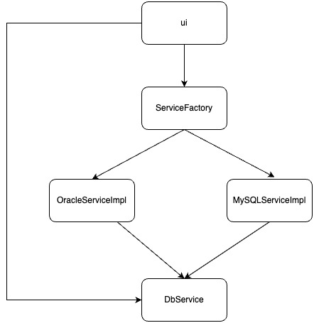

# 服务

模块系统通过提供服务和使用服务的方式实现模块间的解耦。

比如下面的程序:



DbService 负责提供接口, OracleServiceImpl 和 MySQLServiceImpl 是 DbService 的两个实现类。为了避免 ui 模块直接引用具体的实现类, 中间增加了一层工厂来解耦, 但是 ui 仍然需要导入工厂模块, 工厂模块仍然需要导入所有实现类。

## 提供服务

修改 OracleServiceImpl 的 module-info.java:

```java
module OracleServiceImpl {
    // 导入接口
    requires DbService;
    // provides with声明了
    // OracleOperatorImpl类是DbService模块中的DbOperator接口的一个实现类
    provides demo.api.DbOperator with demo.impl.OracleOperatorImpl;
}
```

同理, MySQLServiceImpl 的 module-info.java:

```java
module MySQLServiceImpl {
    requires DbService;
    provides demo.api.DbOperator with demo.impl.MySQLOperatorImpl;
}
```

提供服务的实现类必须要有一个无参构造方法或者一个名为 provider 的 public static 的无参方法:

```java
// 以OracleServiceImpl为例, 下面两个方法任选其一

private OracleServiceImpl() {
}

public static OracleServiceImpl provider() {
    return new OracleServiceImpl();
}
```

## 使用服务

删除工厂模块, 修改 ui 模块的 module-info.java:

```java
module ui {
    // 导入接口
    requires DbService;
    // 使用接口的实现类
    uses demo.api.DbOperator;
}
```

修改使用接口的代码:

```java
// 使用ServiceLoader获取实现类
ServiceLoader<DbOperator> services = ServiceLoader.load(DbOperator.class);
// 遍历所有找到的实现类
for (DbOperator service : services) {
    System.out.pringln(service.getDbName());
}
```

模块是根据模块描述符中的 requires 关键字进行解析的, 从根模块开始以递归的方式寻找所有的 requires, 在此过程中如果缺少必需的模块, 应用程序将无法启动。
requires 子句表示模块之间严格的编译时关系,而服务的 provides 和 uses 绑定则发生在运行时, 即使在运行时没有绑定任何服务, 应用程序也可以启动。此时调用 ServiceLoader::load 不会创建任何实例。

当解析一个带有 uses 关键字的模块时, 模块系统将在模块路径上找到给定服务类型的所有提供者模块, 并将其添加到解析过程中。
