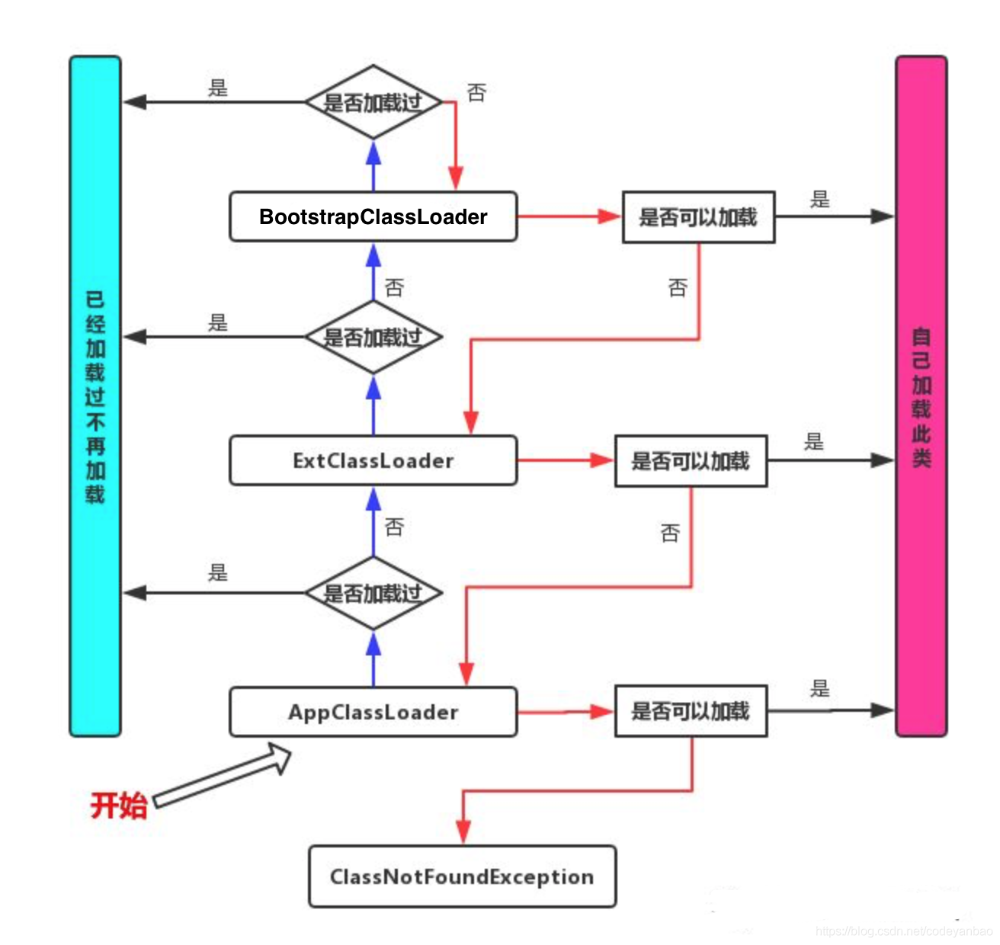

# 类加载器

对于任意一个类，都必须由加载它的类加载器和这个类本身一起共同确立其在Java虚拟机中的唯一性，每一个类加载器，都拥有一个独立的类名称空间。即使这两个类来源于同一个Class文件，被同一个Java虚拟机加载，只要加载它们的类加载器不同，那这两个类就不相等。

Java中内置了三个类加载器：

- 启动类加载器(Bootstrap Class Loader)：最顶层的加载类，由C++实现，是虚拟机自身的一部分。主要用来加载JDK内部的核心类库(%JAVA_HOME%/jre/lib目录下的rt.jar、resources.jar、charsets.jar等)以及被-Xbootclasspath参数指定的路径下的所有类
- 扩展类加载器(Extension Class Loader)：由Java实现，不是虚拟机的一部分。主要负责加载%JAVA_HOME%/jre/lib/ext目录以及被java.ext.dirs系统变量所指定的路径下的类库
- 应用程序类加载器(Application Class Loader)：由Java实现，不是虚拟机的一部分。负责加载用户类路径(classpath)下的所有类库，如果应用程序中没有自定义的类加载器，一般情况下这个就是程序中默认的类加载器。

除了这三种类加载器之外，用户还可以加入自定义的类加载器来进行拓展。比如对Java类的字节码进行加密，加载时再利用自定义的类加载器对其解密。

每个类加载器可以通过getParent方法获取其父类加载器，如果获取到的类加载器为null，那么该类是通过启动类加载器加载的。因为C++实现的启动类加载器在Java中是没有与之对应的类的，所以拿到的结果是null。

## 双亲委派模型

双亲委派模型(Parents Delegation Model)的执行流程：如果一个类加载器收到了类加载的请求，它首先不会自己去尝试加载这个类，而是把这个请求委派给父类加载器去完成，每一个层次的类加载器都是如此，因此所有的加载请求最终都应该传送到最顶层的启动类加载器中，只有当父加载器反馈自己无法完成这个加载请求时，子加载器才会尝试自己去完成加载。



java.lang.ClassLoader的loadClass()中的相关代码：

```java
protected Class<?> loadClass(String name, boolean resolve)
    throws ClassNotFoundException
{
    synchronized (getClassLoadingLock(name)) {
        //首先，检查该类是否已经加载过
        Class c = findLoadedClass(name);
        if (c == null) {
            //如果 c 为 null，则说明该类没有被加载过
            long t0 = System.nanoTime();
            try {
                if (parent != null) {
                    //当父类的加载器不为空，则通过父类的loadClass来加载该类
                    c = parent.loadClass(name, false);
                } else {
                    //当父类的加载器为空，则调用启动类加载器来加载该类
                    c = findBootstrapClassOrNull(name);
                }
            } catch (ClassNotFoundException e) {
                //非空父类的类加载器无法找到相应的类，则抛出异常
            }

            if (c == null) {
                //当父类加载器无法加载时，则调用findClass方法来加载该类
                //用户可通过覆写该方法，来自定义类加载器
                long t1 = System.nanoTime();
                c = findClass(name);

                //用于统计类加载器相关的信息
                sun.misc.PerfCounter.getParentDelegationTime().addTime(t1 - t0);
                sun.misc.PerfCounter.getFindClassTime().addElapsedTimeFrom(t1);
                sun.misc.PerfCounter.getFindClasses().increment();
            }
        }
        if (resolve) {
            //对类进行link操作
            resolveClass(c);
        }
        return c;
    }
}
```

自定义加载器如果不想打破双亲委派模型，就重写ClassLoader类中的findClass方法即可，无法被父类加载器加载的类最终会通过这个方法被加载。如果想要打破双亲委派模型则需要重写loadClass方法。

双亲委派模型可以避免类的重复加载，也保证了Java的核心API不被篡改。例如类java.lang.Object，它存放在rt.jar之中，无论哪一个类加载器要加载这个类，最终都是委派给处于模型最顶端的启动类加载器进行加载，因此Object类在程序的各种类加载器环境中都能够保证是同一个类。如果用户自己也编写了一个名为java.lang.Object的类，将会发现它可以正常编译，但永远无法被加载运行。
