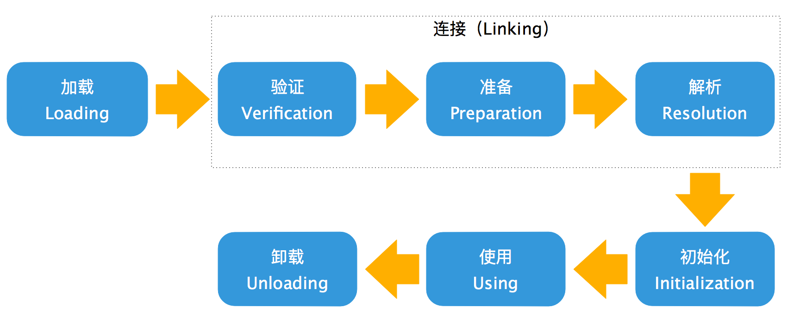

# 类加载的时机

Java虚拟机把描述类的数据从Class文件加载到内存，并对数据进行校验、转换解析和初始化，最终形成可以被虚拟机直接使用的Java类型，这个过程被称作虚拟机的类加载机制。

Java语言里面，类型的加载、连接和初始化过程都是在程序运行期间完成的。

类的生命周期将会经历加载(Loading)、验证(Verification)、准备(Preparation)、解析(Resolution)、初始化(Initialization)、使用(Using)和卸载(Unloading)七个阶段，其中验证、准备、解析三个部分统称为连接(Linking)。

---

加载、验证、准备、初始化和卸载这五个阶段的顺序是确定的，类型的加载过程必须按
照这种顺序开始，而解析阶段则不一定。

《Java虚拟机规范》严格规定了有且只有六种情况必须立即对类进行初始化:

1. 遇到`new`、`getstatic`、`putstatic`或`invokestatic`这四条字节码指令时，如果类型没有进行过初始化，则需要先触发其初始化阶段。能够生成这四条指令的典型Java代码场景有：
    1. 使用new关键字实例化对象的时候
    2. 读取或设置一个类型的静态字段(被final修饰、已在编译期把结果放入常量池的静态字段除外)的时候
    3. 调用一个类的静态方法的时候
2. 进行反射调用的时候，如果类型没有进行过初始化，则需要先触发其初始化
3. 当初始化类的时候，如果发现其父类还没有进行过初始化，则需要先触发其父类的初始化
4. 当虚拟机启动时，用户需要指定一个要执行的主类(包含main方法的那个类)，虚拟机会先初始化这个主类
5. 当使用JDK 7新加入的动态语言支持时，如果一个java.lang.invoke.MethodHandle实例最后的解析结果为REF_getStatic、REF_putStatic、REF_invokeStatic、REF_newInvokeSpecial四种类型的方法句柄，并且这个方法句柄对应的类没有进行过初始化，则需要先触发其初始化
6. 当一个接口中定义了JDK 8新加入的默认方法(被default关键字修饰的接口方法)时，如果有这个接口的实现类发生了初始化，那该接口要在其之前被初始化

这六种场景中的行为称为对一个类型进行主动引用。除此之外，所有引用类型的方式都不会触发初始化，称为被动引用。

