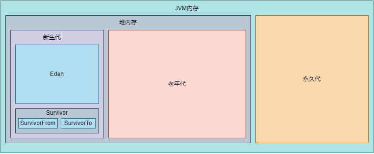

# Java 堆

Java 堆(Java Heap)是 Java 虚拟机运行时内存的一部分，主要用于存储对象。

## 堆空间划分

JVM 内存划分为堆内存和非堆内存，堆内存的划分由 JVM 使用哪个垃圾回收器决定，一般分为新生代(Young Generation)和老年代(Old Generation)。非堆内存为永久代(Permanent Generation)。

新生代与老年代的默认比例是 2:1。

新生代又分为 Eden 和 Survivor 区。Survivor 区由 SurvivorFrom 和 SurvivorTo 组成。Eden 区占大容量，Survivor 两个区占小容量，默认比例是 8:1:1。

堆内存：存放的是对象，垃圾收集器主要就是收集这些对象。

非堆内存：也称为方法区，存储程序运行时长期存活的对象，比如类的元数据、方法、常量、属性等，方法区的垃圾收集是可选的。

在 JDK1.8 版本废弃了永久代，替代的是元空间(MetaSpace)，元空间与永久代上类似，都是方法区的实现，他们最大区别是：元空间并不在 JVM 中，而是使用本地内存。
