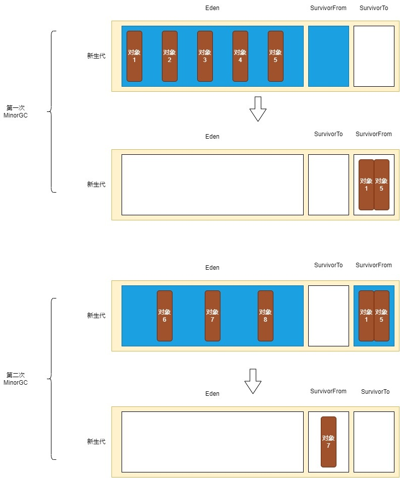

# 内存分配与垃圾回收

大多数情况下, 对象在新生代 Eden 区中分配。每当 Eden 区没有足够空间进行分配时, 虚拟机将发起一次 Minor GC。

Minor GC(Young GC)是指清理新生代内存区域的垃圾回收, 只涉及到新生代中的对象。当 Eden 区满时, 会触发 Minor GC。垃圾收集器会检查 Eden 区和 SurvivorFrom 区的所有对象, 把其中存活的对象复制到 SurvivorTo 区, 然后直接清空 Eden 区和 SurvivorFrom 区。最后会把 SurvivorFrom 区和 SurvivorTo 区的定义交换, 即原来的 SurvivorFrom 区变成了 SurvivorTo 区, 原来的 SurvivorTo 区变成了 SurvivorFrom 区。

如果经过第一次 Minor GC 后仍然存活, 并且能被 SurvivorTo 容纳的话, 该对象会被移动到 SurvivorTo 中, 并且将其对象年龄设为 1 岁。对象在 Survivor 区中每熬过一次 Minor GC, 年龄就增加 1 岁, 当它的年龄增加到一定程度(默认为 15), 就会被移动到老年代中。另外, 如果一个对象超过了一定大小, 会直接被分配在老年代。

如果老年代空间不足, 会触发 Major GC。

Major GC 是指清理老年代内存区域的垃圾回收, 只涉及到老年代中的对象。Major GC 的速度一般会比 Minor GC 慢 10 倍以上, 程序暂停时间更长。Major GC 执行时, 通常会先做一次 Minor GC, 再紧接着进行 Major GC。只有 CMS 收集器会只收集老年代。

Full GC 是在堆内存不足时触发的对整个堆内存进行的垃圾回收, 当新生代和老年代内存区域都满了的时候, 就会触发 Full GC。此外, 当方法区满了, 或者系统空闲时间比较长时, 也可能会触发 Full GC。在进行 Full GC 时, 虚拟机可能会检查并回收不再使用的类的元数据信息, 从而释放一些元空间。但是, 这取决于具体的虚拟机实现和配置设置, 不同的虚拟机可能有不同的行为。一般来说, Full GC 主要是针对堆内存的垃圾回收, 而对于元空间的回收, 虚拟机会有专门的机制来进行管理和回收。

当 JVM 因为没有足够的内存来为对象分配空间并且垃圾回收器也已经没有空间可回收时, 就会抛出 OutOfMemoryError。
