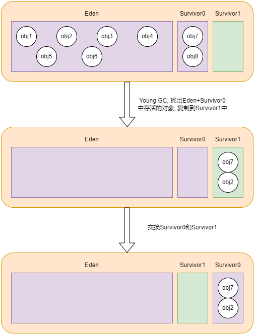

# 内存分配与垃圾回收

大多数情况下, 对象会在新生代的 Eden 区中分配。当 Eden 区没有足够的内存空间进行分配时, JVM 将发起一次 Young GC。

## Young GC

Young GC(Minor GC)是指清理新生代内存区域的垃圾回收, 只涉及到新生代中的对象。当 Eden 区空间不足时, 就会触发 Young GC。垃圾回收器会检查 Eden 区和 Survivor0 区的所有对象, 把其中存活的对象复制到 Survivor1 区, 然后直接清空 Eden 区和 Survivor0 区。最后会把 Survivor0 区和 Survivor1 区的定义交换, 即原来的 Survivor0 区变成了 Survivor1 区, 原来的 Survivor1 区变成了 Survivor0 区。

如果某个对象经过一次 Young GC 后仍然存活, 并且能被 Survivor1 容纳的话, 该对象会被移动到 Survivor1 中, 并且将其年龄增加 1 岁, 当它的年龄增加到一定程度(默认为 15)后, 就会被移动到老年代中。另外, 如果一个对象占用的空间太大, 也会直接被分配在老年代中。

如果老年代空间不足, 会触发 Old GC。

## Old GC

Old GC(Major GC) 是指清理老年代内存区域的垃圾回收, 只涉及到老年代中的对象。Old GC 的速度一般会比 Young GC 慢得多, 程序暂停时间更长。Old GC 执行时, 通常会先做一次 Young GC, 再紧接着执行 Old GC。只有 CMS 会只收集老年代。

## Full GC

Full GC 是在垃圾回收后堆内存仍然不足时触发的对整个堆内存进行的垃圾回收, 当新生代和老年代内存区域都满了的时候, 就会触发 Full GC。此外, 当方法区满了, 或者系统空闲时间比较长时, 也可能会触发 Full GC。在进行 Full GC 时, JVM 可能会检查并回收不再使用的类, 从而释放一些元空间。但是, 这取决于具体的 JVM 实现和配置设置, 不同的 JVM 可能有不同的行为。一般来说, Full GC 主要是针对堆内存的垃圾回收, 而对于元空间, JVM 会有专门的机制来进行管理和回收。

当 JVM 因为没有足够的内存来为对象分配空间并且垃圾回收器也已经没有空间可回收时, 就会抛出 OutOfMemoryError。
