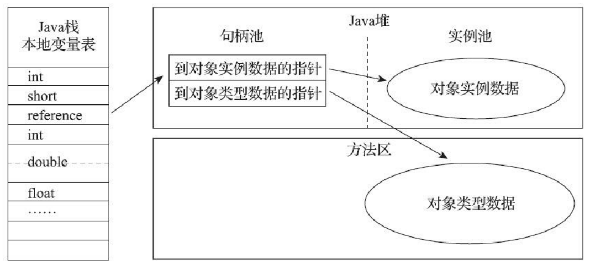
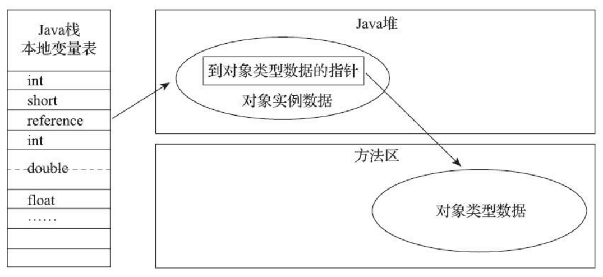

# 对象的访问定位

主流的对象访问方式主要有使用句柄和直接指针两种。

# 使用句柄访问

使用句柄访问的话，Java堆中会划分出一块内存来作为句柄池，引用类型的变量中存储的就是对象的句柄地址，而句柄中包含了对象实例数据与类型数据各自具体的地址信息。

使用句柄来访问的最大好处就是reference中存储的是稳定句柄地址，在对象被移动时(垃圾收集时移动对象是非常普遍的行为)只会改变句柄中的实例数据指针，而reference本身不需要被修改。

# 使用直接指针访问

使用直接指针访问的话，Java堆中的对象内就必须有访问类型数据的相关信息，引用类型的变量中存储的直接就是对象地址，如果只是访问对象本身的话，就不需要多一次间接访问的开销。

使用直接指针来访问最大的好处就是速度更快，它节省了一次指针定位的时间开销，由于对象访问在Java中非常频繁，因此这类开销积少成多也是一项极为可观的执行成本。

HotSpot虚拟机主要使用直接指针来进行对象访问。
