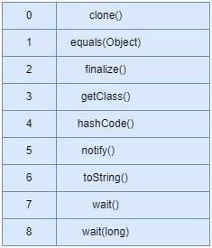
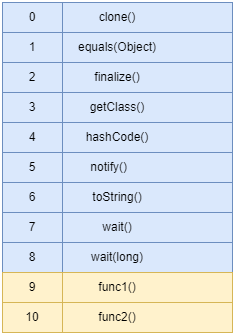
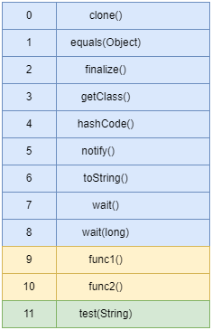

# 动态分派

在运行时根据实际类型确定方法执行版本的分派过程称为动态分派。

```java
public abstract class Human {
    public abstract void sayHello();
}

public class Man extends Human {
    @Override
    public void sayHello() {
        System.out.println("Man");
    }
}

public class Woman extends Human {
    @Override
    public void sayHello() {
        System.out.println("Woman");
    }
}

public class DynamicDispatch {

    public static void main(String[] args) {
        Human man = new Man();
        Human woman = new Woman();
        man.sayHello();
        woman.sayHello();
        man = new Woman();
        man.sayHello();
    }
}
```

程序运行结果: 

```
Man
Woman
Woman
```

上面代码编译后的字节码使用`javap -verbose DynamicDispatch.class`命令解析后如下: 


`aload_1`表示把局部变量表的索引为 1 的变量压入栈顶。`aload_2`表示把局部变量表的索引为 2 的变量压入栈顶。

Java 实现多态的根源就在于虚方法调用指令 invokevirtual 的执行逻辑。invokevirtual 指令的运行过程:

1. 找到操作数栈顶的对象的实际类型, 记作 C
2. 如果在类型 C 中找到与常量中的描述符和简单名称都相符的方法, 则进行访问权限校验。如果通过, 则返回这个方法的直接引用, 查找过程结束。不通过则抛出 java.lang.IllegalAccessError
3. 如果没有匹配的方法, 则按照继承关系从下往上依次对 C 的各个父类进行第 2 步的搜索和验证过程
4. 如果始终没有找到合适的方法, 则抛出 java.lang.AbstractMethodError

## 虚方法表

invokevirtual 指令的运行过程需要频繁地在接收者类型的方法元数据中搜索合适的目标方法。

一种基础的优化手段是为类型在方法区中建立一个虚方法表(Virtual Method Table, vtable), 与此对应的, 在 invokeinterface 执行时也会用到接口方法表(Interface Method Table, itable)。

虚方法表本质上是一个数组, 每个数组元素指向一个当前类及其祖先类中非私有的实例方法。方法表满足两个特征: 

1. 子类虚方法表中包含父类虚方法表中的所有方法
2. 子类方法在虚方法表中的索引值, 与它所重写的父类方法的索引值相同

在执行过程中, Java 虚拟机将获取调用者的实际类型, 并在该实际类型的虚方法表中, 根据索引值获得目标方法。

```java
public abstract class Human {
    public abstract void func1();
    public void func2() {
        System.out.println("Human");
    }
}

public class Man extends Human {
    @Override
    public void func1() {
        System.out.println("Man");
    }
    public void test(String arg) {
        System.out.println(arg);
    }
}

public class Woman extends Human {
    @Override
    public void func1() {
        System.out.println("Woman");
    }
}
```

Object 的虚方法表: 



Human 的虚方法表: 



Man 的虚方法表: 



Woman 的虚方法表: 


