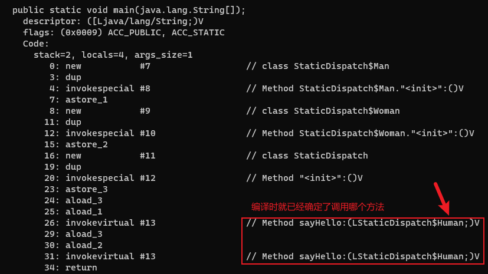

# 分派

分派(Dispatch)调用分为静态分派和动态分派。

解析与分派之间的关系并不是二选一的排他关系，它们是在不同层次上去筛选、确定目标方法的过程。

## 静态分派

```java
public abstract class Human {}

public class Man extends Human {}

public class Woman extends Human {}

public class StaticDispatch {

    public void sayHello(Human guy) {
        System.out.println("Human");
    }

    public void sayHello(Man guy) {
        System.out.println("Man");
    }

    public void sayHello(Woman guy) {
        System.out.println("Woman");
    }

    public static void main(String[] args) {
        Human man = new Man();
        Human woman = new Woman();
        StaticDispatch sr = new StaticDispatch();
        sr.sayHello(man);
        sr.sayHello(woman);
    }
}
```

程序运行结果：

```
Human
Human
```

main()里面的两次sayHello()方法调用，使用哪个重载版本，取决于传入参数的数量和数据类型。

`Human man = new Man()`这行代码中的`Human`称为变量的静态类型(Static Type)，后面的`Man`称为变量的实际类型(Actual Type)。静态类型是在编译期可知的，而实际类型在运行时才可以确定，编译器在编译程序的时候并不知道一个对象的实际类型是什么。

静态分派的最典型的应用就是方法重载。方法在重载时是通过参数的静态类型作为判定依据的。由于静态类型在编译期可知，所以在编译阶段，编译器就可以根据参数的静态类型决定使用哪个重载版本，并把这个方法的符号引用写到main()方法里的两条invokevirtual指令的参数中。



所有依赖静态类型来决定方法执行版本的分派动作，都称为静态分派。静态分派发生在编译阶段，因此确定静态分派的动作不是由虚拟机来执行的。

## 动态分派

在运行时根据实际类型确定方法执行版本的分派过程称为动态分派。

```java
public abstract class Human {
    public abstract void sayHello();
}

public class Man extends Human {
    @Override
    public void sayHello() {
        System.out.println("Man");
    }
}

public class Woman extends Human {
    @Override
    public void sayHello() {
        System.out.println("Woman");
    }
}

public class DynamicDispatch {

    public static void main(String[] args) {
        Human man = new Man();
        Human woman = new Woman();
        man.sayHello();
        woman.sayHello();
        man = new Woman();
        man.sayHello();
    }
}
```

程序运行结果：

```
Man
Woman
Woman
```

上面代码编译后的字节码使用`javap -verbose DynamicDispatch.class`命令解析后如下：


`aload_1`表示把局部变量表的索引为1的变量压入栈顶。`aload_2`表示把局部变量表的索引为2的变量压入栈顶。

invokevirtual指令的运行过程:

1. 找到操作数栈顶的元素所指向的对象的实际类型，记作C
2. 如果在类型C中找到与常量中的描述符和简单名称都相符的方法，则进行访问权限校验。如果通过，则返回这个方法的直接引用，查找过程结束。不通过则返回java.lang.IllegalAccessError异常
3. 如果没有匹配的方法，则按照继承关系从下往上依次对C的各个父类进行第2步的搜索和验证过程
4. 如果始终没有找到合适的方法，则抛出java.lang.AbstractMethodError异常

Java实现多态的根源就在于虚方法调用指令invokevirtual的执行逻辑。

## 单分派与多分派

方法的接收者与方法的参数都是方法的宗量。根据分派基于多少种宗量，可以将分派划分为单分派和多分派两种。

```java
public class Dispatch {
    static class QQ {}

    static class _360 {}

    public static class Father {
        public void hardChoice(QQ arg) {
            System.out.println("father choose qq");
        }

        public void hardChoice(_360 arg) {
            System.out.println("father choose 360");
        }
    }

    public static class Son extends Father {
        public void hardChoice(QQ arg) {
            System.out.println("son choose qq");
        }

        public void hardChoice(_360 arg) {
            System.out.println("son choose 360");
        }
    }

    public static void main(String[] args) {
        Father father = new Father();
        Father son = new Son();
        father.hardChoice(new _360());
        son.hardChoice(new QQ());
    }
}
```

程序运行结果：

```
father choose 360
son choose qq
```

首先是编译阶段中编译器的选择过程，也就是静态分派的过程。这时候选择目标方法的依据有两点：一是静态类型是Father还是Son，二是方法参数是QQ还是360。这次选择结果的最终产物是产生了两条invokevirtual指令，两条指令的参数分别为常量池中指向`Father::hardChoice(360)`及`Father::hardChoice(QQ)`方法的符号引用。

因为是根据两个宗量进行选择，所以Java语言的静态分派属于多分派类型。

然后是运行阶段中虚拟机的选择，也就是动态分派的过程。在执行`son.hardChoice(new QQ())`这行代码所对应的invokevirtual指令时，由于编译期已经决定目标方法的签名必须为`hardChoice(QQ)`，虚拟机此时不会关心传递过来的参数，因为这时候参数的静态类型、实际类型都对方法的选择不会构成任何影响，唯一可以影响虚拟机选择的因素只有该方法的接收者的实际类型是Father还是Son。

因为只有一个宗量作为选择依据，所以Java语言的动态分派属于单分派类型。

# 虚方法表

invokevirtual指令的运行过程需要运行时频繁地在接收者类型的方法元数据中反复搜索合适的目标方法。

一种基础的优化手段是为类型在方法区中建立一个虚方法表(Virtual Method Table，也称为vtable)，与此对应的，在invokeinterface执行时也会用到接口方法表(Interface Method Table，简称itable)。

虚方法表是一个方法指针数组，用于存储该类中的虚方法。虚方法表中的每个元素都指向实际的方法代码。虚方法表的结构类似于一个方法索引表，用于快速查找和调用实际的方法。当通过一个对象引用调用方法时，JVM会根据对象的实际类型在虚方法表中查找对应的方法指针，然后调用该方法。


如果某个父类的方法没有被子类重写，那么在子类的方法表里边该方法指向的是父类的方法的入口，比如继承自Object的方法没有被重写，所以虚方法表中所有从Object继承来的方法都指向了Object。

如果子类重写了父类的方法，那么子类这个重写的方法的索引和父类的该方法的索引是一致的。比如Father的hardChoice(QQ)方法被Son重写了，那么Son的hardChoice(QQ)方法的索引和Father的hardChoice(QQ)方法的索引都是1(打个比方)，这样做的目的是为了快速查找，比如说在子类里边找不到一个方法索引为1的方法，那么JVM会直接去父类查找方法索引为1的方法，不需要重新在父类里边遍历。
