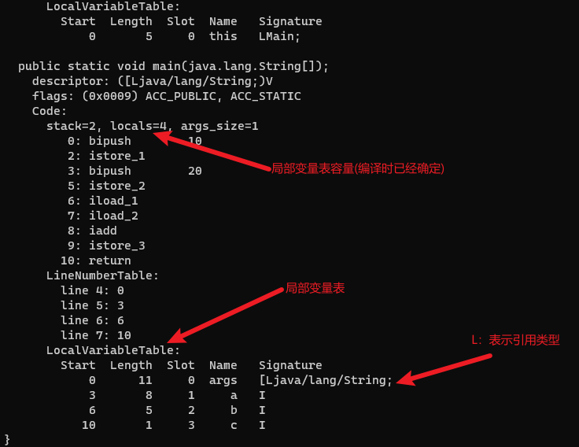
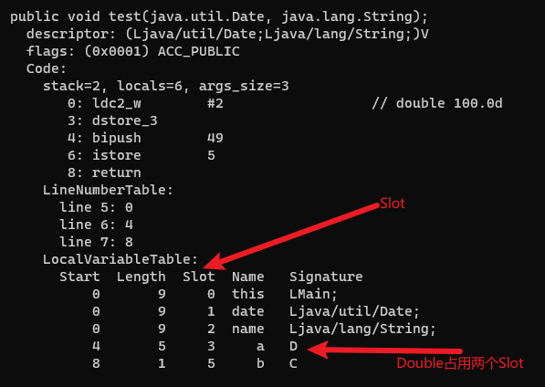

# 局部变量表

局部变量表(Local Variables Table)是一个数组，用于存放方法参数和方法内部定义的局部变量，Java虚拟机通过索引访问局部变量表中的数据。

在Java程序被编译为字节码文件时，就在方法的Code属性的max_locals数据项中确定了该方法所需分配的局部变量表的最大容量。

```java
public class Main {
    public static void main(String[] args) {
        int a = 10;
        int b = 20;
        int c = a + b;
    }
}
```

上面代码编译后的字节码使用`javap -verbose Main.class`命令解析后如下：



## 变量槽

局部变量表最基本的存储单元是槽(Variable Slot)。

一个变量槽可以存放一个32位的数据类型，Java中占用不超过32位存储空间的数据类型有boolean、byte、char、short、int、float、reference和returnAddress这8种。reference类型表示对一个对象实例的引用，returnAddress类型目前已经很少见了。

对于64位的数据类型，Java虚拟机会为其分配两个连续的变量槽空间。Java中明确的64位的数据类型只有long和double两种。

局部变量表会先为方法的参数分配变量槽，参数表分配完毕后，再根据方法体内部定义的变量顺序和作用域分配其余的变量槽。但如果是实例方法的局部变量表，那么局部变量表中第0位索引的变量槽默认是this变量，其余参数则按照参数表顺序排列，从索引1开始分配。

```java
public class Main {
    public void test(Date date, String name) {
        double a = 100;
        char b = '1';
    }
}
```

上面代码编译后的字节码使用`javap -verbose Main.class`命令解析后如下：



局部变量表中的变量槽是可以重用的。方法体中定义的变量，其作用域并不一定会覆盖整个方法体，如果一个局部变量出了其作用域，那这个变量对应的变量槽就可以交给其他变量来重用。
