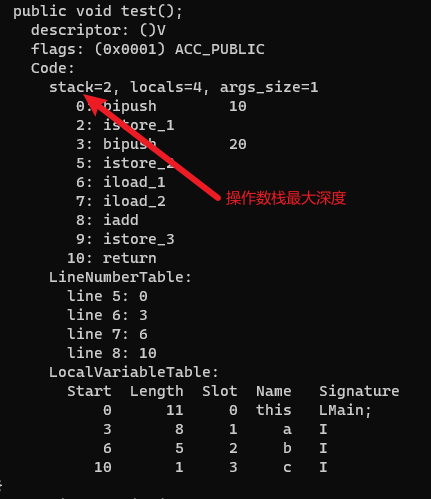

# 操作数栈

操作数栈(Operand Stack)主要用于保存计算过程的中间结果, 同时作为计算过程中变量临时的存储空间。

例如整数加法的字节码指令 iadd 在运行的时候要求操作数栈中最接近栈顶的两个元素已经存入了两个 int 型的数值, 当执行这个指令时, 会把这两个 int 值出栈并相加, 然后将相加的结果重新入栈。

操作数栈的每一个元素可以是任意 Java 数据类型, 32 位的数据类型占一个栈容量, 64 位的数据类型占 2 个栈容量。

操作数栈的最大深度也在编译的时候就已经确定, 并存储到 Code 属性的 max_stacks 数据项之中。

```java
public class Main {
    public void test() {
        int a = 10;
        int b = 20;
        int c = a + b;
    }
}
```

上面代码编译后的字节码使用`javap -verbose Main.class`命令解析后如下: 


