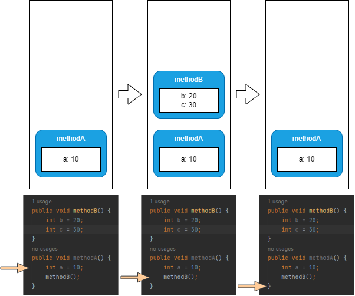

# 栈和栈帧

Java虚拟机栈是线程私有的，它与线程的生命周期同步。每个方法的执行都会创建一个栈帧，栈帧包含局部变量表、操作数栈、动态链接、方法出口等。

入栈：每一次方法调用都会有一个对应的栈帧被压入栈中。

出栈：方法调用结束后，会从栈顶弹出。

---

栈可能出现的异常

- 线程请求的栈深度大于虚拟机所允许的最大深度时，会抛出StackOverflowError异常
- 在尝试扩展虚拟机栈的时候无法申请到足够的内存，或者在创建新的线程时没有足够的内存去创建对应的虚拟机栈，就会抛出OutOfMemoryError异常

---

```java
public void methodB() {
    int b = 20;
    int c = 30;
}
public void methodA() {
    int a = 10;
    methodB();
}
```

上面代码运行时栈的变化如下：



---

栈帧：一个方法从调用开始到执行完成，就对应着一个栈帧在虚拟机栈中从入栈到出栈的过程。

栈帧的组成：

1. 局部变量表
2. 操作数栈（或表达式栈）
3. 动态链接（或指向运行时常量池的方法引用）
4. 方法返回地址（或方法正常退出或者异常退出的定义）
5. 一些额外的附加信息
