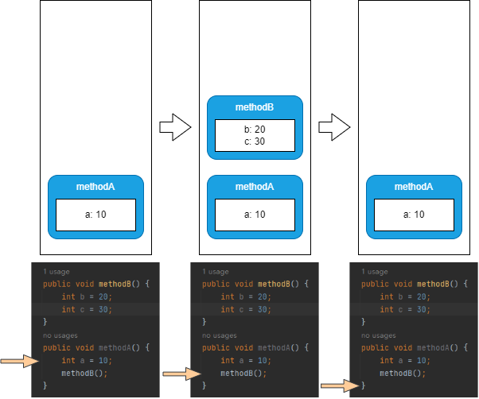

# 栈帧

每个方法被执行的时候，Java虚拟机都会同步创建一个栈帧(Stack Frame)用于存储局部变量表、操作数栈、动态连接、方法出口等信息。

每一个方法被调用直至执行完毕的过程，就对应着一个栈帧在虚拟机栈中从入栈到出栈的过程。

对于执行引擎来讲，在活动线程中，只有位于栈顶的方法才是在运行的，只有位于栈顶的栈帧才是生效的，其被称为当前栈帧(Current Stack Frame)，与这个栈帧所关联的方法被称为当前方法(Current Method)。执行引擎所运行的所有字节码指令都只针对当前栈帧进行操作。

---

```java
public void methodB() {
    int b = 20;
    int c = 30;
}
public void methodA() {
    int a = 10;
    methodB();
}
```

上面代码运行时栈的变化如下：


