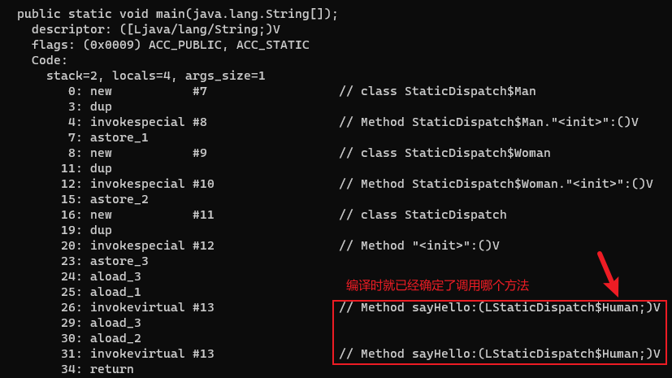

# 静态分派

```java
public abstract class Human {}

public class Man extends Human {}

public class Woman extends Human {}

public class StaticDispatch {

    public void sayHello(Human guy) {
        System.out.println("Human");
    }

    public void sayHello(Man guy) {
        System.out.println("Man");
    }

    public void sayHello(Woman guy) {
        System.out.println("Woman");
    }

    public static void main(String[] args) {
        Human man = new Man();
        Human woman = new Woman();
        StaticDispatch sr = new StaticDispatch();
        sr.sayHello(man);
        sr.sayHello(woman);
    }
}
```

程序运行结果: 

```
Human
Human
```

main()里面的两次 sayHello()方法调用, 使用哪个重载版本, 取决于传入参数的数量和数据类型。

`Human man = new Man()`这行代码中的`Human`称为变量的静态类型(Static Type), 后面的`Man`称为变量的实际类型(Actual Type)。静态类型是在编译期可知的, 而实际类型在运行时才可以确定, 编译器在编译程序的时候并不知道一个对象的实际类型是什么。

静态分派的最典型的应用就是方法重载。方法在重载时是通过参数的静态类型作为判定依据的。由于静态类型在编译期可知, 所以在编译阶段, 编译器就可以根据参数的静态类型决定使用哪个重载版本, 并把这个方法的符号引用写到 main()方法里的两条 invokevirtual 指令的参数中。



所有依赖静态类型来决定方法执行版本的分派动作, 都称为静态分派。静态分派发生在编译阶段, 因此确定静态分派的动作不是由JVM来执行的。
