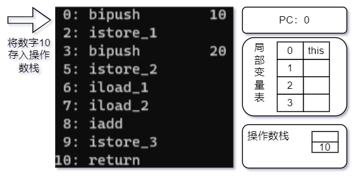
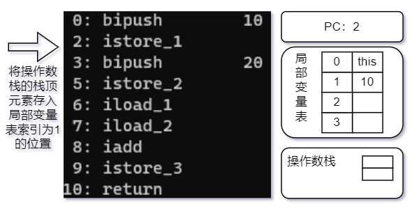
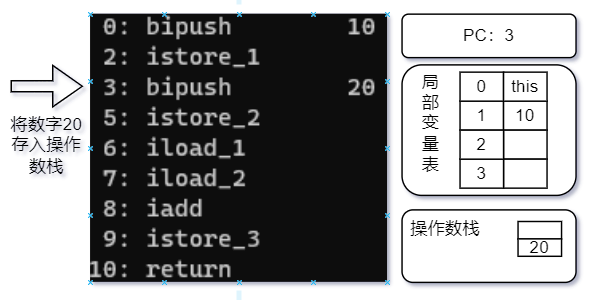
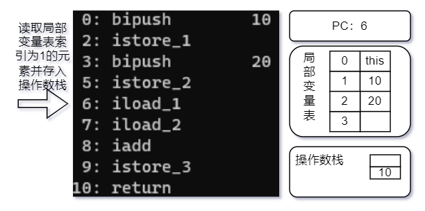
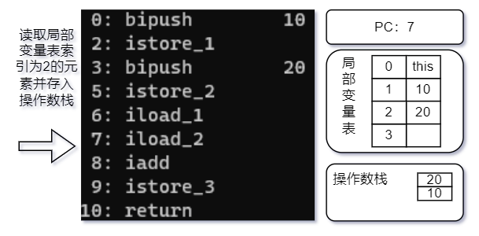
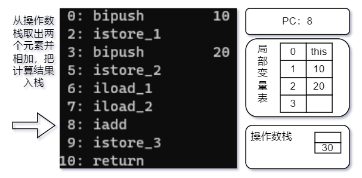
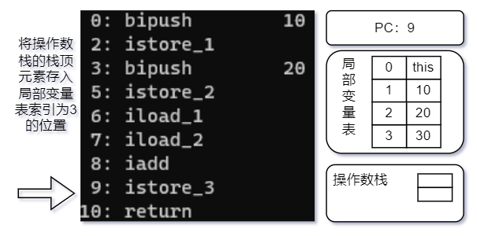

# 基于栈的指令集

Javac的字节码指令是一种基于栈的指令集架构(Instruction Set Architecture，ISA)，字节码指令大部分都是零地址指令，它们依赖操作数栈进行工作。与之相对的另外一套常用的指令集架构是基于寄存器的指令集，最典型的就是x86的二地址指令集，这些指令依赖寄存器进行工作。

## 分别使用这两种指令集去计算1+1的结果

基于栈的指令集：

```
iconst_1
iconst_1
iadd
istore_0
```

两条iconst_1指令连续把两个常量1压入栈后，iadd指令把栈顶的两个值出栈、相加，然后把结果放回栈顶，最后istore_0把栈顶的值放到局部变量表的第0个变量槽中。这种指令流中的指令通常都是不带参数的，使用操作数栈中的数据作为指令的运算输入，指令的运算结果也存储在操作数栈之中。

基于寄存器的指令集：

```
mov eax, 1
add eax, 1
```

mov指令把EAX寄存器的值设为1，然后add指令再把这个值加1，结果就保存在EAX寄存器里面。这种二地址指令是x86指令集中的主流，每个指令都包含两个单独的输入参数，依赖于寄存器来访问和存储数据。

---

基于栈的指令集主要优点是可移植，因为寄存器由硬件直接提供，程序不依赖这些硬件寄存器就不会受到硬件的约束。用户程序不会直接用到这些寄存器，那就可以由虚拟机实现来自行决定把一些访问最频繁的数据(程序计数器、栈顶缓存等)放到寄存器中以提高性能，这样实现起来也更简单一些。

栈架构指令集的主要缺点是执行速度相对来说会稍慢一些，栈架构指令集的代码完成相同功能所需的指令数量一般会比寄存器架构更多，因为出栈、入栈操作本身就产生了相当大量的指令。而且栈实现在内存中，频繁的栈访问也就意味着频繁的内存访问，相对于处理器来说，内存始终是执行速度的瓶颈。

# 基于栈的解释器执行过程

```java
public class Main {
    public void test() {
        int a = 10;
        int b = 20;
        int c = a + b;
    }
}
```

字节码运行时栈帧中各部分的变化如下：















