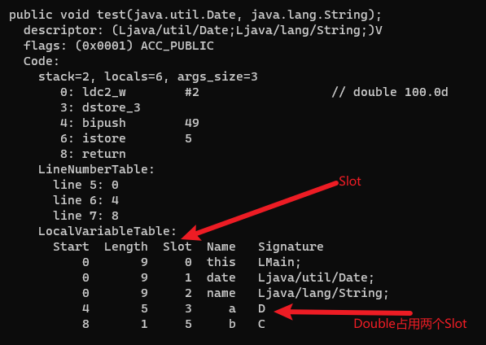

# 局部变量表

局部变量表(Local Variables)：是一个数字数组，主要用于存储方法参数和定义在方法体内的局部变量，这些数据类型包括各类基本数据类型、对象引用，以及returnAddress类型。局部变量表是线程私有的。

局部变量表所需的容量大小是在编译期确定下来的，并保存在字节码中。方法运行期间不会改变局部变量表的大小。

局部变量表中的变量只在当前方法调用中有效，当方法调用结束后，随着方法栈帧的销毁，局部变量表也会随之销毁。


```java
public class Main {
    public static void main(String[] args) {
        int a = 10;
        int b = 20;
        int c = a + b;
    }
}
```

上面代码编译后的字节码使用`javap -verbose Main.class`命令解析后如下：


## 变量槽(Slot)

局部变量表最基本的存储单元是槽(Slot)，局部变量表中存放编译期可知的各种基本数据类型(8种)，引用类型，returnAddress类型的变量。32位以内的类型占用一个slot(包括returnAddress类型)，64位的类型(long和double)占用两个slot。

JVM会为局部变量表中的每一个Slot都分配一个访问索引，通过这个索引即可成功访问到局部变量表中指定的局部变量值。

如果当前栈帧是由构造方法或者实例方法创建的，那么该对象引用this将会存放在index为0的slot处，其余的参数按照参数表的顺序继续进行存储。

Slot是可以重复利用的。如果一个局部变量出了其作用域，那么在其作用域之后声明的新的局部变量就很可能会重复使用过期的局部变量的槽位。

```java
public class Main {
    public void test(Date date, String name) {
        double a = 100;
        char b = '1';
    }
}
```

上面代码编译后的字节码使用`javap -verbose Main.class`命令解析后如下：


