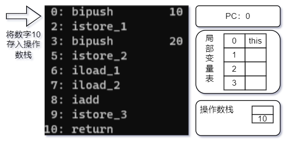
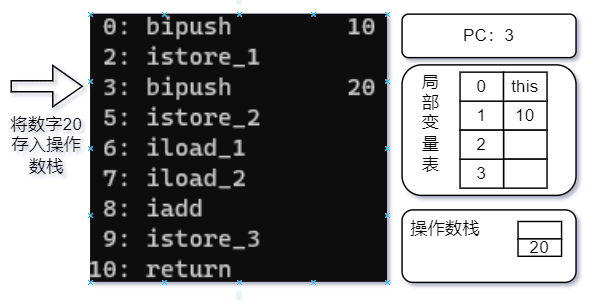
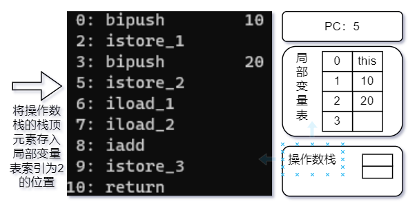
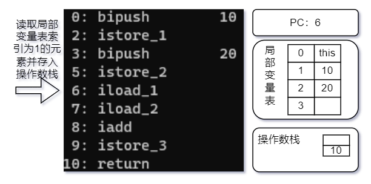
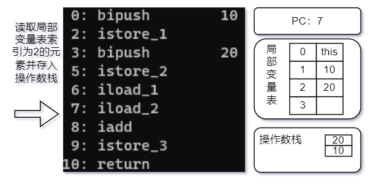
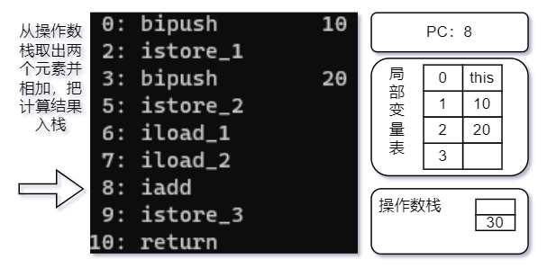
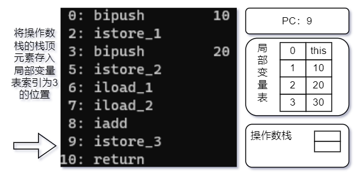

# 操作数栈

每一个独立的栈帧除了包含局部变量表以外，还包含一个后进先出的操作数栈，也可以称之为表达式栈（Expression Stack）。操作数栈主要用于保存计算过程的中间结果，同时作为计算过程中变量临时的存储空间。

每一个操作数栈都会拥有一个明确的栈深度用于存储数值，其所需的最大深度在编译期就定义好了，保存在字节码中。

操作数栈的每一个元素可以是任意Java数据类型，32位的数据类型占一个栈容量，64位的数据类型占2个栈容量。

```java
public class Main {
    public void test() {
        int a = 10;
        int b = 20;
        int c = a + b;
    }
}
```

上面代码编译后的字节码使用`javap -verbose Main.class`命令解析后如下：


字节码运行时栈帧中各部分的变化如下：









