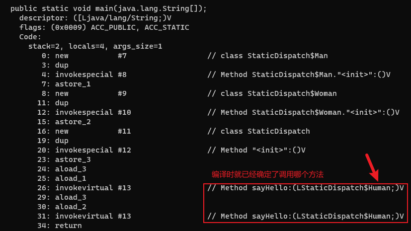
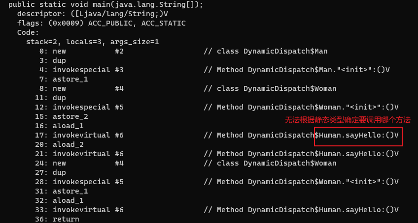

# 方法调用

方法调用阶段唯一的任务就是确定要调用哪一个方法。

主要的方法调用形式：解析和分派。

# 解析

在类加载过程中的解析(Resolution)阶段，JVM会将字节码文件里的一部分符号引用转化为直接引用，这些方法是在编译那一刻就已经确定下来，并且在JVM运行期间是不会改变的。这类方法的调用被称为解析(Resolution)。

符合“编译期可知，运行期不可变”要求的方法，主要有静态方法和私有方法两大类。前者与类型直接关联，后者在外部不可被访问，这两种方法各自的特点决定了它们都不可能通过继承或别的方式重写出其他版本，因此它们都适合在类加载阶段进行解析。

# JVM调用方法的指令

- invokestatic：用于调用静态方法
- invokespecial：用于调用实例构造器`<init>()`方法、私有方法和父类中的方法
- invokevirtual：用于调用所有的虚方法
- invokeinterface：用于调用接口方法，会在运行时再确定一个实现该接口的对象
- invokedynamic：先在运行时动态解析出所引用的方法，然后再执行该方法

# 虚方法

只要能被invokestatic和invokespecial指令调用的方法，都是符合“编译期可知，运行期不可变”要求的方法。

Java语言里符合这个条件的方法共有静态方法、私有方法、实例构造器、父类方法(子类中通过super.xxx()调用)、被final修饰的方法，这5种方法调用会在类加载的时候就可以把符号引用解析为直接引用。这些方法统称为非虚方法(Non-Virtual Method)。与之相反，其他方法就被称为虚方法(Virtual Method)。

其中被final修饰的方法比较特殊，由于历史设计的原因，它使用invokevirtual指令调用。

# 分派

分派（Dispatch）调用可能是静态的也可能是动态的。

## 静态分派

演示
```java
public class StaticDispatch {
    static abstract class Human {}

    static class Man extends Human {}

    static class Woman extends Human {}

    public void sayHello(Human guy) {
        System.out.println("hello,guy!");
    }

    public void sayHello(Man guy) {
        System.out.println("hello,gentleman!");
    }

    public void sayHello(Woman guy) {
        System.out.println("hello,lady!");
    }

    public static void main(String[] args) {
        Human man = new Man();
        Human woman = new Woman();
        StaticDispatch sr = new StaticDispatch();
        sr.sayHello(man);
        sr.sayHello(woman);
    }
}
```

程序运行结果：

```
hello,guy!
hello,guy!

Process finished with exit code 0
```

Human man = new Man() 这行代码中的Human称为变量的静态类型(Static Type)，或者叫外观类型(Apparent Type)，后面的Man则被称为变量的实际类型(Actual Type)或者叫运行时类型(Runtime Type)。

静态类型是在编译期可知的，而实际类型变化的结果在运行期才可确定，编译器在编译程序的时候并不知道一个对象的实际类型是什么。

```java
// 实际类型变化，编译时无法确定
Human human = (new Random()).nextBoolean() ? new Man() : new Woman();
// 静态类型变化，即使强制转型，编译时也可以确定
sr.sayHello((Man) human)
sr.sayHello((Woman) human)
```

main()里面的两次sayHello()方法调用，使用哪个重载版本，取决于传入参数的数量和数据类型。

代码中故意定义了两个静态类型相同，而实际类型不同的变量，但方法在重载时是通过参数的静态类型作为判定依据的。由于静态类型在编译期可知，所以在编译阶段，编译器就可以根据参数的静态类型决定使用哪个重载版本，并把这个方法的符号引用写到main()方法里的两条invokevirtual指令的参数中。



所有依赖静态类型来决定方法执行版本的分派动作，都称为静态分派。静态分派的最典型的应用就是方法重载。

静态分派发生在编译阶段，因此确定静态分派的动作实际上不是由虚拟机来执行的。

注意：解析与分派这两者之间的关系并不是二选一的排他关系，它们是在不同层次上去筛选、确定目标方法的过程。例如前面说过静态方法会在编译期确定、在类加载期就进行解析，而静态方法显然也是可以拥有重载版本的，选择重载版本的过程也是通过静态分派完成的。

## 动态分派

演示
```java
public class DynamicDispatch {

    static abstract class Human {
        protected abstract void sayHello();
    }

    static class Man extends Human {
        @Override
        protected void sayHello() {
            System.out.println("man say hello");
        }
    }

    static class Woman extends Human {
        @Override
        protected void sayHello() {
            System.out.println("woman say hello");
        }
    }

    public static void main(String[] args) {
        Human man = new Man();
        Human woman = new Woman();
        man.sayHello();
        woman.sayHello();
        man = new Woman();
        man.sayHello();
    }
}
```

程序运行结果：

```
man say hello
woman say hello
woman say hello

Process finished with exit code 0
```

上面代码编译后的字节码使用`javap -verbose DynamicDispatch.class`命令解析后如下：



```
0: new           #2                  // class DynamicDispatch$Man
3: dup
4: invokespecial #3                  // Method DynamicDispatch$Man."<init>":()V
7: astore_1
8: new           #4                  // class DynamicDispatch$Woman
11: dup
12: invokespecial #5                  // Method DynamicDispatch$Woman."<init>":()V
15: astore_2
```

上面的指令为man和woman分配内存空间，并把两个变量放入局部变量表。

`16: aload_1`和`20: aload_2`表示把局部变量表的两个变量分别压入栈顶。

invokevirtual指令的运行过程:

1. 找到操作数栈顶的第一个元素所指向的对象的实际类型，记作C
2. 如果在类型C中找到与常量中的描述符和简单名称都相符的方法，则进行访问权限校验。如果通过，则返回这个方法的直接引用，查找过程结束。不通过则返回java.lang.IllegalAccessError异常
3. 如果没有匹配的方法，则按照继承关系从下往上依次对C的各个父类进行第二步的搜索和验证过程
4. 如果始终没有找到合适的方法，则抛出java.lang.AbstractMethodError异常

invokevirtual指令并不是把常量池中方法的符号引用解析到直接引用上就结束了，还会根据方法接收者的实际类型来选择方法版本。

Java实现多态的根源就在于虚方法调用指令invokevirtual的执行逻辑。

这种在运行期根据实际类型确定方法执行版本的分派过程称为动态分派。

## 单分派与多分派

方法的接收者与方法的参数都是方法的宗量。根据分派基于多少种宗量，可以将分派划分为单分派和多分派两种。

演示
```java
public class Dispatch {
    static class QQ {}

    static class _360 {}

    public static class Father {
        public void hardChoice(QQ arg) {
            System.out.println("father choose qq");
        }

        public void hardChoice(_360 arg) {
            System.out.println("father choose 360");
        }
    }

    public static class Son extends Father {
        public void hardChoice(QQ arg) {
            System.out.println("son choose qq");
        }

        public void hardChoice(_360 arg) {
            System.out.println("son choose 360");
        }
    }

    public static void main(String[] args) {
        Father father = new Father();
        Father son = new Son();
        father.hardChoice(new _360());
        son.hardChoice(new QQ());
    }
}
```

程序运行结果：

```
father choose 360
son choose qq

Process finished with exit code 0
```

首先是编译阶段中编译器的选择过程，也就是静态分派的过程。这时候选择目标方法的依据有两点：一是静态类型是Father还是Son，二是方法参数是QQ还是360。这次选择结
果的最终产物是产生了两条invokevirtual指令，两条指令的参数分别为常量池中指向
Father::hardChoice(360)及Father::hardChoice(QQ)方法的符号引用。

因为是根据两个宗量进行选择，所以Java语言的静态分派属于多分派类型。

然后是运行阶段中虚拟机的选择，也就是动态分派的过程。在执行son.hardChoice(new QQ())这行代码时，更准确地说，是在执行这行代码所对应的invokevirtual指令时，由于编译期已经决定目标方法的签名必须为hardChoice(QQ)，虚拟机此时不会关心传递过来的参数，因为这时候参数的静态类型、实际类型都对方法的选择不会构成任何影响，唯一可以影响虚拟机选择的因素只有该方法的接收者的实际类型是Father还是Son。

因为只有一个宗量作为选择依据，所以Java语言的动态分派属于单分派类型。

# 虚方法表

invokevirtual指令的运行过程需要运行时频繁地在接收者类型的方法元数据中反复搜索合适的目标方法。

一种基础的优化手段是为类型在方法区中建立一个虚方法表（Virtual Method Table，也称为vtable，与此对应的，在invokeinterface执行时也会用到接口方法表——Interface Method Table，简称itable），虚方法表中存放着各个方法的实际入口地址，查找虚方法表来代替元数据查找以提高性能。


如果某个父类的方法没有被子类重写，那么在子类的方法表里边该方法指向的是父类的方法的入口，比如继承自Object的方法没有被重写，所以虚方法表中所有从Object继承来的方法都指向了Object。

如果子类重写了父类的方法，那么子类这个重写的方法的索引和父类的该方法的索引是一致的。比如Father的hardChoice(QQ)方法被Son重写了，那么Son的hardChoice(QQ)方法的索引和Father的hardChoice(QQ)方法的索引都是1(打个比方)，这样做的目的是为了快速查找，比如说在子类里边找不到一个方法索引为1的方法，那么JVM会直接去父类查找方法索引为1的方法，不需要重新在父类里边遍历。
