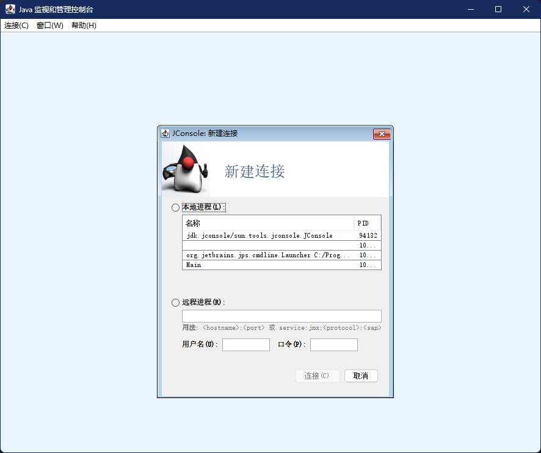
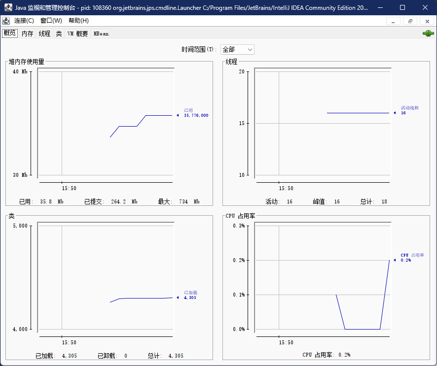

# JConsole

JConsole是一款基于JMX的可视化监视、管理工具。它的主要功能是通过JMX的MBean对系统进行信息收集和参数动态调整。JMX是用于监控和管理JVM资源的一组标准API。虚拟机对JMX MBean的访问也是完全开放的, 可以使用代码调用API、支持JMX协议的管理控制台, 或者其他符合JMX规范的软件进行访问。

## 启动JConsole

通过JDK/bin目录下的jconsole.exe启动JConsole后, 会自动搜索出本机运行的所有虚拟机进程。双击选择其中一个进程便可进入主界面开始监控。

概述页签里显示的是整个虚拟机主要运行数据的概览信息, 包括堆内存使用情况、线程、类、CPU使用情况四项信息的曲线图, 这些曲线图是后面内存、线程、类页签的信息汇总。

