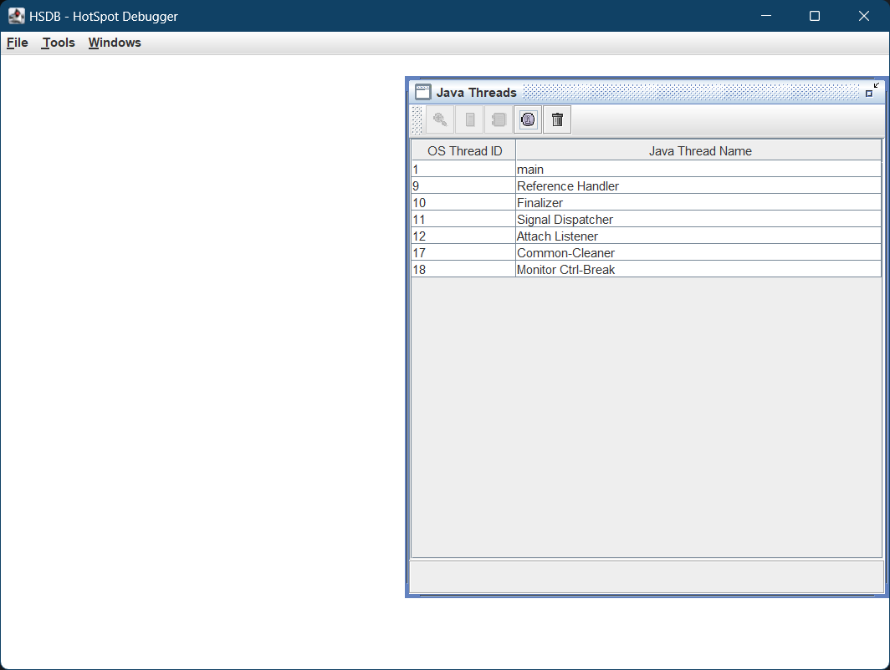
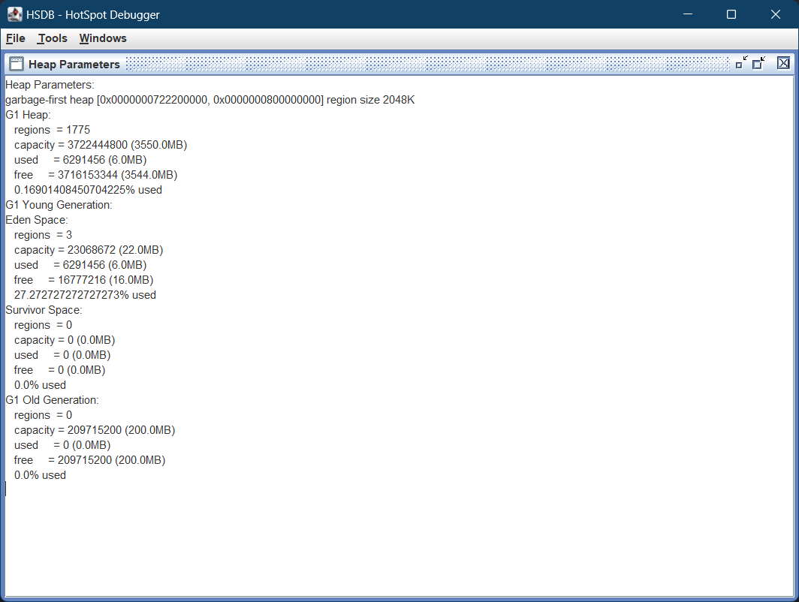
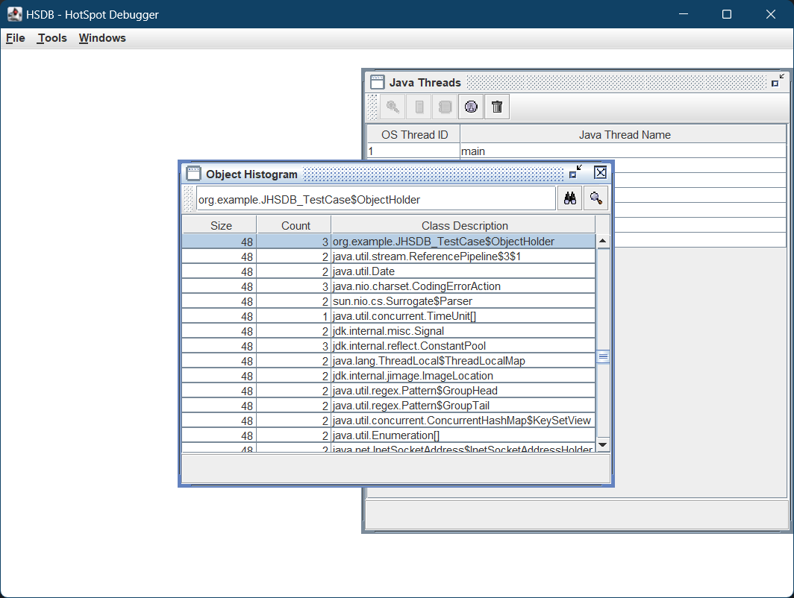
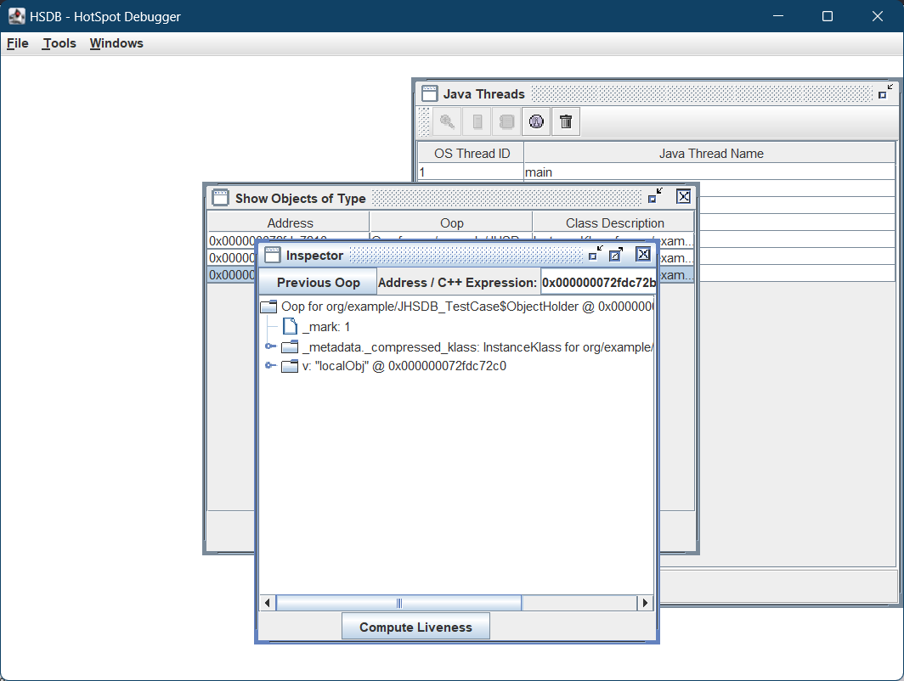

# jhsdb

Jhsdb 是 JDK9 引入的工具, 它有 clhsdb、debugd、hsdb、jstack、jmap、jinfo、jsnap 这些 mode 可以使用, jhsdb 整合了多个其他工具的功能, 还做了一些功能拓展。

jhsdb 的 jdk 版本必须和项目保持一致。

## hsdb

hsdb 是 jhsdb 中的图形化工具。

测试代码:

```java
package org.example;

public class JHSDB_TestCase {
    static class Test {
        static ObjectHolder staticObj = new ObjectHolder("staticObj");
        ObjectHolder instanceObj = new ObjectHolder("instanceObj");

        void foo() {
            ObjectHolder localObj = new ObjectHolder("localObj");
            try {
                Thread.sleep(Long.MAX_VALUE);
            } catch (InterruptedException e) {
                throw new RuntimeException(e);
            }
        }
    }

    private static class ObjectHolder {
        public String v;

        public ObjectHolder(String v) {
            this.v = v;
        }
    }

    public static void main(String[] args) {
        Test test = new JHSDB_TestCase.Test();
        test.foo();
    }
}
```

启动项目, jps 查看 pid:

```sh
$ jps
14164 JHSDB_TestCase
```

启动 hsdb:

```sh
jhsdb hsdb --pid 14164
```

初始界面:



Tools -> Heap Parameters 查看堆内存分布:



Tools -> Object Histogram 可以看到方法区里的所有 class, 输入类的全限定名(静态内部类用$分隔)后回车可以搜索:



双击可以看到这个类创建的对象:


选择一个对象, 点击 Inspect 可以看到对象的相关属性:


