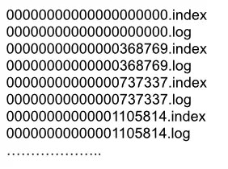

# 消息存储结构

Kafka 有 Topic 和 Partition 两个概念，一个 Topic 可以有多个 Partition。在实际存储的时候，Topic + Partition 对应一个文件夹，这个文件夹对应的是这个 Partition 的数据。

在 Kafka 的数据文件目录下，一个 Partition 对应一个唯一的文件夹。如果有 4 个 Topic，每个 Topic 有 5 个 Partition，那么一共会有 4 \* 5 = 20 个文件夹。而在文件夹下，Kafka 消息是采用 Segment File 的存储方式进行存储的。

Segment File：将大文件拆分成小文件来存储，这样一个大文件就变成了一段一段(Segment 段)。这样的好处是 IO 加载速度快，不会有很长的 IO 加载时间。

在 Kafka 的数据文件夹下，分为两种类型的文件：索引文件(Index File)和数据文件(Log File)。索引文件存的是消息的索引信息，帮助快速定位到某条消息。数据文件存储的是具体的消息内容。

## 索引文件

索引文件的命名统一为数字格式，其名称表示 Kafka 消息的偏移量。假设索引文件的文件名为 N.index，那么就代表该索引文件存储的第一条 Kafka 消息的偏移量为 N + 1，而上个文件存储的最后一条 Kafka 消息的偏移量为 N(因为 Kafka 是顺序存储的)。例如 368769.index 索引文件，其表示文件存储的第一条 Kafka 消息的偏移量为 368770。而 368769 表示的是 0000.index 这个索引文件的最后一条消息。所以 368769.index 存储的 Kafka 消息偏移量范围为 368769 ~ 737337。

索引文件存储的是简单地索引数据，其格式为：`offset,物理偏移量`。其中 offset 表示索引文件里的第几条消息，而物理偏移量则表示该条消息在数据文件(Log File)中的物理偏移地址。例如 368769.index 中的 `3,497` 表示：索引文件里的第 3 条消息(即 offset 368772 的消息，368772 = 368769+3)，其在数据文件中的物理偏移地址为 497。

## 数据文件

数据文件的命名格式与索引文件的命名格式完全一样，数据文件就是所有消息的一个列表，而每条消息都有一个固定的格式。

| 结构                | 说明                                                                                                             |
| ------------------- | ---------------------------------------------------------------------------------------------------------------- |
| 8 byte offset       | 在 parition 内的每条消息都有一个有序的 id，这个 id 被称为偏移(offset),它可以唯一确定每条消息在 parition 内的位置 |
| 4 byte message size | message 的大小                                                                                                   |
| 4 byte CRC32        | 用 crc32 校验 message                                                                                            |
| 1 byte “magic”      | 表示本次发布 Kafka 服务程序协议版本号                                                                            |
| 1 byte “attributes” | 表示为独立版本、或标识压缩类型、或编码类型                                                                       |
| 4 byte key length   | 表示 key 的长度,当 key 为-1 时，K byte key 字段不填                                                              |
| K byte key          | 可选                                                                                                             |
| value bytes payload | 实际消的息数据                                                                                                   |

## 稀疏索引

索引文件中并不会存储每条消息在数据文件的偏移地址。如果把所有消息的 `offset，物理偏移量` 信息都存入 index 文件的话，会导致文件太大，无法一次性读内存, 频繁读取磁盘降低读取效率。

如果要寻找第 7 条消息，那只需要找到第 6 条消息的物理偏移量。之后在读取数据文件的时候直接跳过 1 条消息就可以了。
