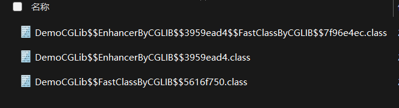

# CGLIB动态代理的用法

maven依赖
```xml
<dependency>
    <groupId>cglib</groupId>
    <artifactId>cglib</artifactId>
    <version>3.3.0</version>
</dependency>
```

被代理类
```java
package org.example;

public class DemoCGLib {
    public void call() {
        System.out.println("ok");
    }
}
```

实现动态代理
```java
package org.example;
import net.sf.cglib.proxy.MethodInterceptor;
import net.sf.cglib.proxy.MethodProxy;
import java.lang.reflect.Method;

public class DemoProxy implements MethodInterceptor {
    public Object intercept(Object o, Method method, Object[] args, MethodProxy methodProxy) throws Throwable {
        System.out.println("pre");
        Object returnValue = methodProxy.invokeSuper(o, args);
        System.out.println("post");
        return returnValue;
    }
}
```

使用动态代理
```java
package org.example;
import net.sf.cglib.core.DebuggingClassWriter;
import net.sf.cglib.proxy.Enhancer;

public class App {
    public static void main(String[] args) {
        Enhancer enhancer = new Enhancer();
        // 被代理类
        enhancer.setSuperclass(DemoCGLib.class);
        enhancer.setCallback(new DemoProxy());
        DemoCGLib proxyInstance = (DemoCGLib) enhancer.create();
        proxyInstance.call();
    }
}
```

输出
```
pre
ok
post

Process finished with exit code 0
```

# 把动态生成的代理类保存到磁盘

在程序入口加下下面一行
```java
package org.example;
import net.sf.cglib.core.DebuggingClassWriter;
import net.sf.cglib.proxy.Enhancer;

public class App {
    public static void main(String[] args) {
        // 指定 CGLIB 将动态生成的代理类保存至指定的磁盘路径下
        System.setProperty(DebuggingClassWriter.DEBUG_LOCATION_PROPERTY, "C:\\Users\\Public\\cglib_output");

        Enhancer enhancer = new Enhancer();
        // 被代理类
        enhancer.setSuperclass(DemoCGLib.class);
        enhancer.setCallback(new DemoProxy());
        DemoCGLib proxyInstance = (DemoCGLib) enhancer.create();
        proxyInstance.call();
    }
}
```

重新运行程序后，可以看到生成的代理类



# 反编译动态生成的代理类

反编译DemoCGLib$$EnhancerByCGLIB$$3959ead4类

```java
//
// Source code recreated from a .class file by IntelliJ IDEA
// (powered by FernFlower decompiler)
//

package org.example;

import java.lang.reflect.Method;
import net.sf.cglib.core.ReflectUtils;
import net.sf.cglib.core.Signature;
import net.sf.cglib.proxy.Callback;
import net.sf.cglib.proxy.Factory;
import net.sf.cglib.proxy.MethodInterceptor;
import net.sf.cglib.proxy.MethodProxy;

public class DemoCGLib$$EnhancerByCGLIB$$3959ead4 extends DemoCGLib implements Factory {
    private boolean CGLIB$BOUND;
    public static Object CGLIB$FACTORY_DATA;
    private static final ThreadLocal CGLIB$THREAD_CALLBACKS;
    private static final Callback[] CGLIB$STATIC_CALLBACKS;
    private MethodInterceptor CGLIB$CALLBACK_0;
    private static Object CGLIB$CALLBACK_FILTER;
    private static final Method CGLIB$call$0$Method;
    private static final MethodProxy CGLIB$call$0$Proxy;
    private static final Object[] CGLIB$emptyArgs;
    private static final Method CGLIB$equals$1$Method;
    private static final MethodProxy CGLIB$equals$1$Proxy;
    private static final Method CGLIB$toString$2$Method;
    private static final MethodProxy CGLIB$toString$2$Proxy;
    private static final Method CGLIB$hashCode$3$Method;
    private static final MethodProxy CGLIB$hashCode$3$Proxy;
    private static final Method CGLIB$clone$4$Method;
    private static final MethodProxy CGLIB$clone$4$Proxy;

    static void CGLIB$STATICHOOK1() {
        CGLIB$THREAD_CALLBACKS = new ThreadLocal();
        CGLIB$emptyArgs = new Object[0];
        Class var0 = Class.forName("org.example.DemoCGLib$$EnhancerByCGLIB$$3959ead4");
        Class var1;
        Method[] var10000 = ReflectUtils.findMethods(new String[]{"equals", "(Ljava/lang/Object;)Z", "toString", "()Ljava/lang/String;", "hashCode", "()I", "clone", "()Ljava/lang/Object;"}, (var1 = Class.forName("java.lang.Object")).getDeclaredMethods());
        CGLIB$equals$1$Method = var10000[0];
        CGLIB$equals$1$Proxy = MethodProxy.create(var1, var0, "(Ljava/lang/Object;)Z", "equals", "CGLIB$equals$1");
        CGLIB$toString$2$Method = var10000[1];
        CGLIB$toString$2$Proxy = MethodProxy.create(var1, var0, "()Ljava/lang/String;", "toString", "CGLIB$toString$2");
        CGLIB$hashCode$3$Method = var10000[2];
        CGLIB$hashCode$3$Proxy = MethodProxy.create(var1, var0, "()I", "hashCode", "CGLIB$hashCode$3");
        CGLIB$clone$4$Method = var10000[3];
        CGLIB$clone$4$Proxy = MethodProxy.create(var1, var0, "()Ljava/lang/Object;", "clone", "CGLIB$clone$4");
        CGLIB$call$0$Method = ReflectUtils.findMethods(new String[]{"call", "()V"}, (var1 = Class.forName("org.example.DemoCGLib")).getDeclaredMethods())[0];
        CGLIB$call$0$Proxy = MethodProxy.create(var1, var0, "()V", "call", "CGLIB$call$0");
    }

    final void CGLIB$call$0() {
        super.call();
    }

    public final void call() {
        MethodInterceptor var10000 = this.CGLIB$CALLBACK_0;
        if (var10000 == null) {
            CGLIB$BIND_CALLBACKS(this);
            var10000 = this.CGLIB$CALLBACK_0;
        }

        if (var10000 != null) {
            var10000.intercept(this, CGLIB$call$0$Method, CGLIB$emptyArgs, CGLIB$call$0$Proxy);
        } else {
            super.call();
        }
    }

    final boolean CGLIB$equals$1(Object var1) {
        return super.equals(var1);
    }

    public final boolean equals(Object var1) {
        MethodInterceptor var10000 = this.CGLIB$CALLBACK_0;
        if (var10000 == null) {
            CGLIB$BIND_CALLBACKS(this);
            var10000 = this.CGLIB$CALLBACK_0;
        }

        if (var10000 != null) {
            Object var2 = var10000.intercept(this, CGLIB$equals$1$Method, new Object[]{var1}, CGLIB$equals$1$Proxy);
            return var2 == null ? false : (Boolean)var2;
        } else {
            return super.equals(var1);
        }
    }

    final String CGLIB$toString$2() {
        return super.toString();
    }

    public final String toString() {
        MethodInterceptor var10000 = this.CGLIB$CALLBACK_0;
        if (var10000 == null) {
            CGLIB$BIND_CALLBACKS(this);
            var10000 = this.CGLIB$CALLBACK_0;
        }

        return var10000 != null ? (String)var10000.intercept(this, CGLIB$toString$2$Method, CGLIB$emptyArgs, CGLIB$toString$2$Proxy) : super.toString();
    }

    final int CGLIB$hashCode$3() {
        return super.hashCode();
    }

    public final int hashCode() {
        MethodInterceptor var10000 = this.CGLIB$CALLBACK_0;
        if (var10000 == null) {
            CGLIB$BIND_CALLBACKS(this);
            var10000 = this.CGLIB$CALLBACK_0;
        }

        if (var10000 != null) {
            Object var1 = var10000.intercept(this, CGLIB$hashCode$3$Method, CGLIB$emptyArgs, CGLIB$hashCode$3$Proxy);
            return var1 == null ? 0 : ((Number)var1).intValue();
        } else {
            return super.hashCode();
        }
    }

    final Object CGLIB$clone$4() throws CloneNotSupportedException {
        return super.clone();
    }

    protected final Object clone() throws CloneNotSupportedException {
        MethodInterceptor var10000 = this.CGLIB$CALLBACK_0;
        if (var10000 == null) {
            CGLIB$BIND_CALLBACKS(this);
            var10000 = this.CGLIB$CALLBACK_0;
        }

        return var10000 != null ? var10000.intercept(this, CGLIB$clone$4$Method, CGLIB$emptyArgs, CGLIB$clone$4$Proxy) : super.clone();
    }

    public static MethodProxy CGLIB$findMethodProxy(Signature var0) {
        String var10000 = var0.toString();
        switch (var10000.hashCode()) {
            case -508378822:
                if (var10000.equals("clone()Ljava/lang/Object;")) {
                    return CGLIB$clone$4$Proxy;
                }
                break;
            case 548576343:
                if (var10000.equals("call()V")) {
                    return CGLIB$call$0$Proxy;
                }
                break;
            case 1826985398:
                if (var10000.equals("equals(Ljava/lang/Object;)Z")) {
                    return CGLIB$equals$1$Proxy;
                }
                break;
            case 1913648695:
                if (var10000.equals("toString()Ljava/lang/String;")) {
                    return CGLIB$toString$2$Proxy;
                }
                break;
            case 1984935277:
                if (var10000.equals("hashCode()I")) {
                    return CGLIB$hashCode$3$Proxy;
                }
        }

        return null;
    }

    public DemoCGLib$$EnhancerByCGLIB$$3959ead4() {
        CGLIB$BIND_CALLBACKS(this);
    }

    public static void CGLIB$SET_THREAD_CALLBACKS(Callback[] var0) {
        CGLIB$THREAD_CALLBACKS.set(var0);
    }

    public static void CGLIB$SET_STATIC_CALLBACKS(Callback[] var0) {
        CGLIB$STATIC_CALLBACKS = var0;
    }

    private static final void CGLIB$BIND_CALLBACKS(Object var0) {
        DemoCGLib$$EnhancerByCGLIB$$3959ead4 var1 = (DemoCGLib$$EnhancerByCGLIB$$3959ead4)var0;
        if (!var1.CGLIB$BOUND) {
            var1.CGLIB$BOUND = true;
            Object var10000 = CGLIB$THREAD_CALLBACKS.get();
            if (var10000 == null) {
                var10000 = CGLIB$STATIC_CALLBACKS;
                if (var10000 == null) {
                    return;
                }
            }

            var1.CGLIB$CALLBACK_0 = (MethodInterceptor)((Callback[])var10000)[0];
        }

    }

    public Object newInstance(Callback[] var1) {
        CGLIB$SET_THREAD_CALLBACKS(var1);
        DemoCGLib$$EnhancerByCGLIB$$3959ead4 var10000 = new DemoCGLib$$EnhancerByCGLIB$$3959ead4();
        CGLIB$SET_THREAD_CALLBACKS((Callback[])null);
        return var10000;
    }

    public Object newInstance(Callback var1) {
        CGLIB$SET_THREAD_CALLBACKS(new Callback[]{var1});
        DemoCGLib$$EnhancerByCGLIB$$3959ead4 var10000 = new DemoCGLib$$EnhancerByCGLIB$$3959ead4();
        CGLIB$SET_THREAD_CALLBACKS((Callback[])null);
        return var10000;
    }

    public Object newInstance(Class[] var1, Object[] var2, Callback[] var3) {
        CGLIB$SET_THREAD_CALLBACKS(var3);
        DemoCGLib$$EnhancerByCGLIB$$3959ead4 var10000 = new DemoCGLib$$EnhancerByCGLIB$$3959ead4;
        switch (var1.length) {
            case 0:
                var10000.<init>();
                CGLIB$SET_THREAD_CALLBACKS((Callback[])null);
                return var10000;
            default:
                throw new IllegalArgumentException("Constructor not found");
        }
    }

    public Callback getCallback(int var1) {
        CGLIB$BIND_CALLBACKS(this);
        MethodInterceptor var10000;
        switch (var1) {
            case 0:
                var10000 = this.CGLIB$CALLBACK_0;
                break;
            default:
                var10000 = null;
        }

        return var10000;
    }

    public void setCallback(int var1, Callback var2) {
        switch (var1) {
            case 0:
                this.CGLIB$CALLBACK_0 = (MethodInterceptor)var2;
            default:
        }
    }

    public Callback[] getCallbacks() {
        CGLIB$BIND_CALLBACKS(this);
        return new Callback[]{this.CGLIB$CALLBACK_0};
    }

    public void setCallbacks(Callback[] var1) {
        this.CGLIB$CALLBACK_0 = (MethodInterceptor)var1[0];
    }

    static {
        CGLIB$STATICHOOK1();
    }
}
```


可以发现$Proxy0类继承了enhancer.setSuperclass()传入的类DemoCGLib。

$Proxy0中的每一个方法(call、equals、toString等)都增加了var10000.intercept()的调用。

最终DemoCGLib$$EnhancerByCGLIB$$3959ead4中的所有方法都会由实现了MethodInterceptor接口的DemoProxy调用。
