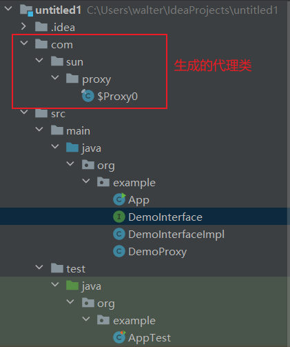
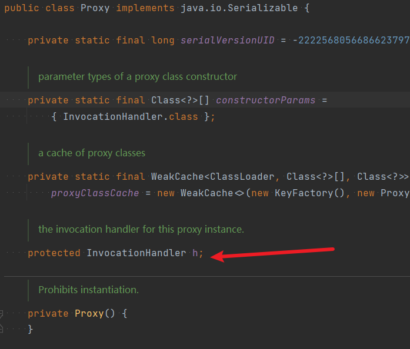

# JDK动态代理的用法

DemoInterface接口
```java
package org.example;

public interface DemoInterface {
    void call();
}
```

DemoInterface接口的实现类
```java
package org.example;

public class DemoInterfaceImpl implements DemoInterface {
    public void call() {
        System.out.println("ok");
    }
}
```

实现动态代理
```java
package org.example;
import java.lang.reflect.InvocationHandler;
import java.lang.reflect.Method;

public class DemoProxy implements InvocationHandler {
    private Object target;
    /**
     * 委托对象一定要手动传入
     * @param target 委托对象
     */
    public DemoProxy(Object target) {
        this.target = target;
    }
    /**
     * @param proxy 不是委托对象
     * @param method 动态代理调用方法时，被调用的那个方法
     * @param args 动态代理调用方法时，传入被调用方法的参数
     */
    public Object invoke(Object proxy, Method method, Object[] args) throws Throwable {
        System.out.println("pre");
        Object returnValue = method.invoke(target, args);
        System.out.println("post");
        return returnValue;
    }
}
```

使用动态代理
```java
package org.example;
import java.lang.reflect.Proxy;

public class App {
    public static void main(String[] args) {
        DemoInterface proxyInstance = (DemoInterface) Proxy.newProxyInstance(App.class.getClassLoader(),
                new Class[]{DemoInterface.class},
                new DemoProxy(new DemoInterfaceImpl()));
        proxyInstance.call();
    }
}
```

输出
```
pre
ok
post

Process finished with exit code 0
```

# 把动态生成的代理类保存到磁盘

在程序入口加下下面一行
```java
package org.example;
import java.lang.reflect.Proxy;

public class App {
    public static void main(String[] args) {
        // 把JDK动态代理生成的类保存到磁盘
        System.getProperties().put("sun.misc.ProxyGenerator.saveGeneratedFiles", "true");
        DemoInterface proxyInstance = (DemoInterface) Proxy.newProxyInstance(App.class.getClassLoader(),
                new Class[]{DemoInterface.class},
                new DemoProxy(new DemoInterfaceImpl()));
        proxyInstance.call();
    }
}
```

重新运行程序后，可以看到生成的代理类



# 反编译动态生成的代理类

```java
//
// Source code recreated from a .class file by IntelliJ IDEA
// (powered by FernFlower decompiler)
//

package com.sun.proxy;

import java.lang.reflect.InvocationHandler;
import java.lang.reflect.Method;
import java.lang.reflect.Proxy;
import java.lang.reflect.UndeclaredThrowableException;
import org.example.DemoInterface;

public final class $Proxy0 extends Proxy implements DemoInterface {
    private static Method m1;
    private static Method m2;
    private static Method m3;
    private static Method m0;

    public $Proxy0(InvocationHandler var1) throws  {
        super(var1);
    }

    public final boolean equals(Object var1) throws  {
        try {
            return (Boolean)super.h.invoke(this, m1, new Object[]{var1});
        } catch (RuntimeException | Error var3) {
            throw var3;
        } catch (Throwable var4) {
            throw new UndeclaredThrowableException(var4);
        }
    }

    public final String toString() throws  {
        try {
            return (String)super.h.invoke(this, m2, (Object[])null);
        } catch (RuntimeException | Error var2) {
            throw var2;
        } catch (Throwable var3) {
            throw new UndeclaredThrowableException(var3);
        }
    }

    public final void call() throws  {
        try {
            super.h.invoke(this, m3, (Object[])null);
        } catch (RuntimeException | Error var2) {
            throw var2;
        } catch (Throwable var3) {
            throw new UndeclaredThrowableException(var3);
        }
    }

    public final int hashCode() throws  {
        try {
            return (Integer)super.h.invoke(this, m0, (Object[])null);
        } catch (RuntimeException | Error var2) {
            throw var2;
        } catch (Throwable var3) {
            throw new UndeclaredThrowableException(var3);
        }
    }

    static {
        try {
            m1 = Class.forName("java.lang.Object").getMethod("equals", Class.forName("java.lang.Object"));
            m2 = Class.forName("java.lang.Object").getMethod("toString");
            m3 = Class.forName("org.example.DemoInterface").getMethod("call");
            m0 = Class.forName("java.lang.Object").getMethod("hashCode");
        } catch (NoSuchMethodException var2) {
            throw new NoSuchMethodError(var2.getMessage());
        } catch (ClassNotFoundException var3) {
            throw new NoClassDefFoundError(var3.getMessage());
        }
    }
}
```

可以发现$Proxy0类实现了Proxy.newProxyInstance()传入的接口DemoInterface。

$Proxy0中的每一个方法(call、equals、toString等)都改成了被super.h.invoke()调用，其中的h如下：



所以，最终$Proxy0中的所有方法都会由实现了InvocationHandler接口的DemoProxy调用。
