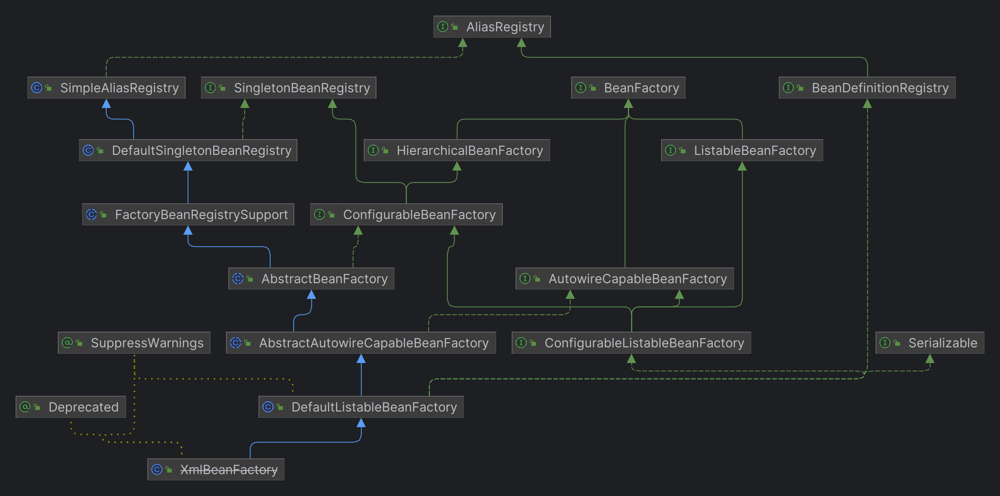

# XmlBeanFactory

当通过Resource相关类完成了对配置文件进行封装后，配置文件的读取工作就会交给XmlBeanFactory来处理。

```java
BeanFactory bf = new XmlBeanFactory(resource);
```



使用Resource实例作为参数的构造方法：

```java
public class XmlBeanFactory extends DefaultListableBeanFactory {
    private final XmlBeanDefinitionReader reader = new XmlBeanDefinitionReader(this);

    public XmlBeanFactory(Resource resource) throws BeansException {
        this(resource, null);
    }

    public XmlBeanFactory(Resource resource, BeanFactory parentBeanFactory) throws BeansException {
        // 忽略给定接口的自动装配功能
        super(parentBeanFactory);
        // 加载Bean
        this.reader.loadBeanDefinitions(resource);
    }
}
```

## 忽略给定接口的自动装配功能

XmlBeanFactory()方法中的super(parentBeanFactory)方法会调用祖先类AbstractAutowireCapableBeanFactory的构造方法：

```java
public abstract class AbstractAutowireCapableBeanFactory extends AbstractBeanFactory
        implements AutowireCapableBeanFactory {

    // super(parentBeanFactory);会调用到这里
    public AbstractAutowireCapableBeanFactory(@Nullable BeanFactory parentBeanFactory) {
        this();
        setParentBeanFactory(parentBeanFactory);
    }

    public AbstractAutowireCapableBeanFactory() {
        super();
        // 忽略给定接口的自动装配功能
        ignoreDependencyInterface(BeanNameAware.class);
        ignoreDependencyInterface(BeanFactoryAware.class);
        ignoreDependencyInterface(BeanClassLoaderAware.class);
    }
}
```

ignoreDependencyInterface()方法的主要功能是忽略给定接口的自动装配功能，比如，当ClassA中有字段fieldB，那么当 Spring在获取ClassA的Bean时如果其字段fieldB还没有初始化，那么Spring会自动初始化fieldB。但是当fieldB指向的bean实现了BeanNameAware、BeanFactoryAware、BeanClassLoaderAware其中的一个接口时，Spring就不会自动初始化fieldB了。

## 加载Bean

XmlBeanFactory调用了XmlBeanDefinitionReader::loadBeanDefinitions()方法去加载bean：

```java
public class XmlBeanDefinitionReader extends AbstractBeanDefinitionReader {
    // 用于记录正在加载的资源
    private final ThreadLocal<Set<EncodedResource>> resourcesCurrentlyBeingLoaded =
            new NamedThreadLocal<>("XML bean definition resources currently being loaded");

    // 首先，使用EncodedResource类封装一下资源文件
    // EncodedResource在设置了编码属性的时候，会使用指定编码读取资源文件
    public int loadBeanDefinitions(Resource resource) throws BeanDefinitionStoreException {
        return loadBeanDefinitions(new EncodedResource(resource));
    }

    public int loadBeanDefinitions(EncodedResource encodedResource) throws BeanDefinitionStoreException {
        // 看一下有没有正在加载的资源
        Set<EncodedResource> currentResources = this.resourcesCurrentlyBeingLoaded.get();
        if (currentResources == null) {
            currentResources = new HashSet<>(4);
            this.resourcesCurrentlyBeingLoaded.set(currentResources);
        }
        // 加入当前资源
        if (!currentResources.add(encodedResource)) {
            throw new BeanDefinitionStoreException(
                    "Detected cyclic loading of " + encodedResource + " - check your import definitions!");
        }
        try {
            // 获取资源文件的InpurStream
            InputStream inputStream = encodedResource.getResource().getInputStream();
            try {
                // 由于使用了SAX来读取XML文件
                // 所以需要把InputStream封装成SAX要求的参数类型InputSource
                InputSource inputSource = new InputSource(inputStream);
                if (encodedResource.getEncoding() != null) {
                    inputSource.setEncoding(encodedResource.getEncoding());
                }
                // 加载bean
                return doLoadBeanDefinitions(inputSource, encodedResource.getResource());
            }
            finally {
                inputStream.close();
            }
        }
        catch (IOException ex) {
            throw new BeanDefinitionStoreException(
                    "IOException parsing XML document from " + encodedResource.getResource(), ex);
        }
        finally {
            // 加载完了，从正在加载的资源集合中移除
            currentResources.remove(encodedResource);
            if (currentResources.isEmpty()) {
                this.resourcesCurrentlyBeingLoaded.remove();
            }
        }
    }

    protected int doLoadBeanDefinitions(InputSource inputSource, Resource resource)
            throws BeanDefinitionStoreException {
        try {
            // 解析XML
            Document doc = doLoadDocument(inputSource, resource);
            // 注册bean
            return registerBeanDefinitions(doc, resource);
        }
        catch (BeanDefinitionStoreException ex) {
            throw ex;
        }
        catch (SAXParseException ex) {
            throw new XmlBeanDefinitionStoreException(resource.getDescription(),
                    "Line " + ex.getLineNumber() + " in XML document from " + resource + " is invalid", ex);
        }
        catch (SAXException ex) {
            throw new XmlBeanDefinitionStoreException(resource.getDescription(),
                    "XML document from " + resource + " is invalid", ex);
        }
        catch (ParserConfigurationException ex) {
            throw new BeanDefinitionStoreException(resource.getDescription(),
                    "Parser configuration exception parsing XML from " + resource, ex);
        }
        catch (IOException ex) {
            throw new BeanDefinitionStoreException(resource.getDescription(),
                    "IOException parsing XML document from " + resource, ex);
        }
        catch (Throwable ex) {
            throw new BeanDefinitionStoreException(resource.getDescription(),
                    "Unexpected exception parsing XML document from " + resource, ex);
        }
    }

    // 解析XML
    protected Document doLoadDocument(InputSource inputSource, Resource resource) 
            throws Exception {
        // getValidationModeForResource()方法获取XML文件的验证模式
        // getEntityResolver()方法返回EntityResolver对象，
        // EntityResolver用来读取本地的DTD/XSD文件并返回给SAX，避免了去网络上寻找相应的声明
        // loadDocument()方法解析XML文件
        return this.documentLoader.loadDocument(inputSource, getEntityResolver(), 
            this.errorHandler, getValidationModeForResource(resource), isNamespaceAware());
    }

    // 注册bean
    public int registerBeanDefinitions(Document doc, Resource resource) 
            throws BeanDefinitionStoreException {
        BeanDefinitionDocumentReader documentReader = createBeanDefinitionDocumentReader();
        int countBefore = getRegistry().getBeanDefinitionCount();
        documentReader.registerBeanDefinitions(doc, createReaderContext(resource));
        return getRegistry().getBeanDefinitionCount() - countBefore;
    }
}
```
