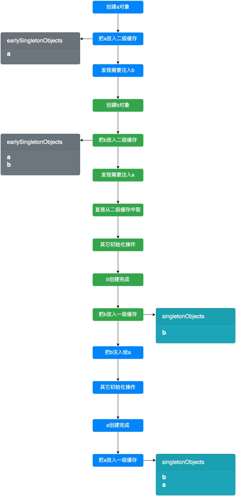
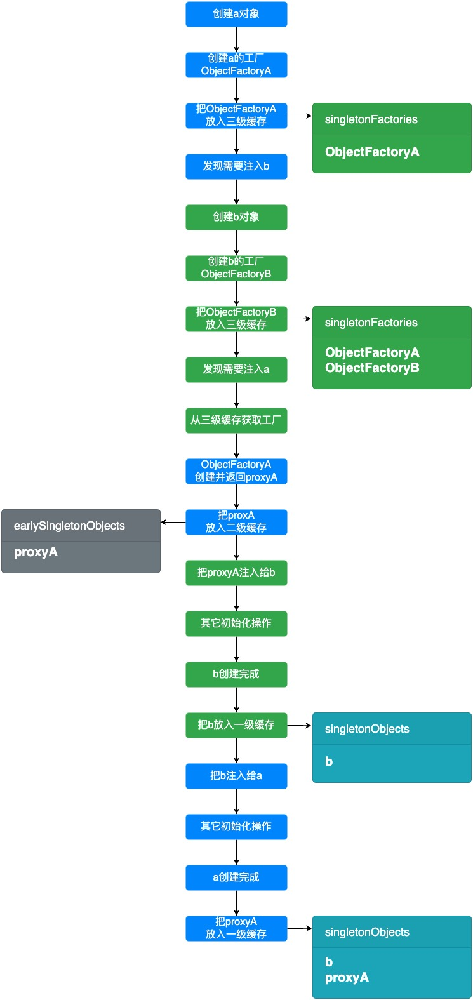

# bean 的循环依赖

```java
@Component
public class A {
    @Autowired
    private B b;
}
@Component
public class B {
    @Autowired
    private A a;
}
```

循环依赖的形成:

1. 创建 a 对象
2. 为 a 注入依赖, 发现 a 需要注入 b
3. 查找 b 是否在容器中
4. b 不在容器中, 开始创建 b
5. 创建 b 对象
6. 为 b 注入依赖, 发现 b 需要注入 a
7. 查找 a 是否在容器中
8. 此时 a 还没创建完, 所以不在容器中
9. 开始创建 a
10. ...

## spring 的三级缓存

1. singletonObjects: 一级缓存, 用来缓存已经初始化完成的 bean
2. earlySingletonObjects: 二级缓存, 用来缓存半成品 bean(只创建了对象, 还没完成依赖注入等过程的 bean)
3. singletonFactories: 三级缓存, 用来缓存 ObjectFactory

## 一级缓存

一级缓存无法解决循环依赖。

## 二级缓存

加入二级缓存后, 普通 bean 的循环依赖可以被解决。



## 三级缓存

如果 a 需要被代理, 那么 b 需要注入的就是 a 的代理类 proxyA, 二级缓存就无法满足了。

三级缓存中的 ObjectFactory 就是用来创建代理类的工厂, 如果 a 需要被代理, ObjectFactory 就会返回 proxyA, 否则就返回 a。



## spring 无法自行解决的循环依赖

构造方法注入时的循环依赖。

解决方法: 使用 `@Lazy` 注解延迟注入。
